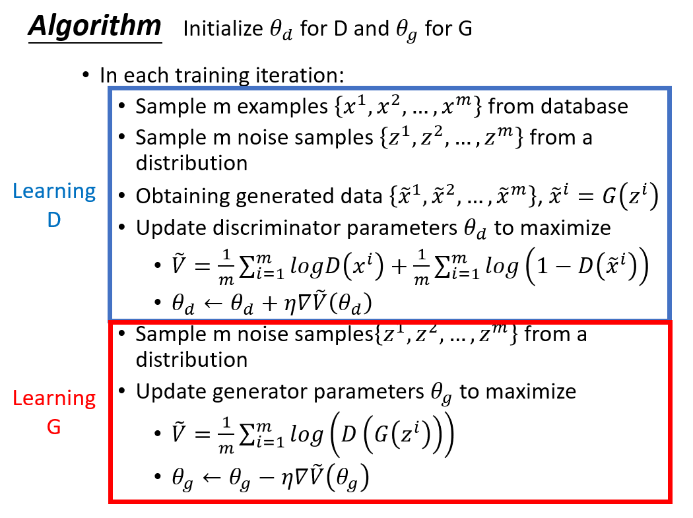
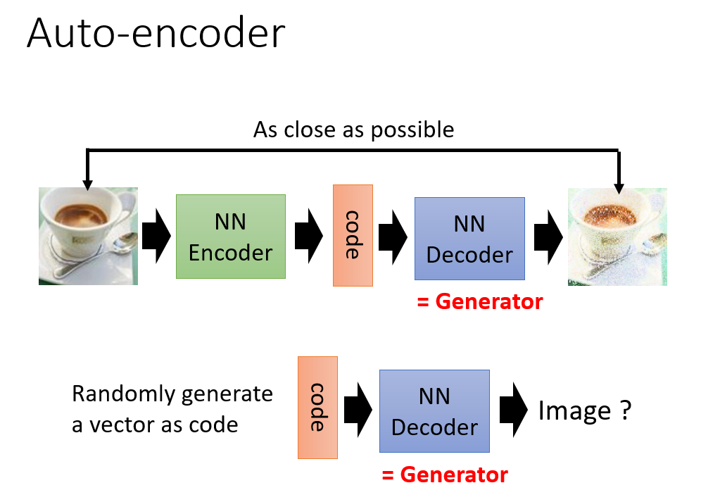

# 李宏毅生成对抗网络(GAN)课程笔记

### **相关链接**

+ [课程网站](http://speech.ee.ntu.edu.tw/~tlkagk/courses_MLDS18.html)
+ [B站搬运](https://www.bilibili.com/video/av24011528)

## Introduction 部分笔记

**最原始的GAN算法**

**Auto-encoder**

**Aariational Auto-encoder (VAE)**

