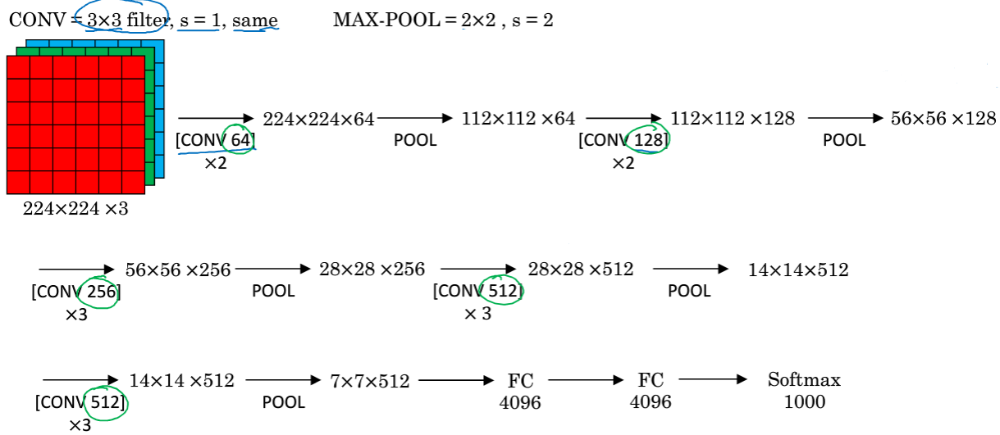
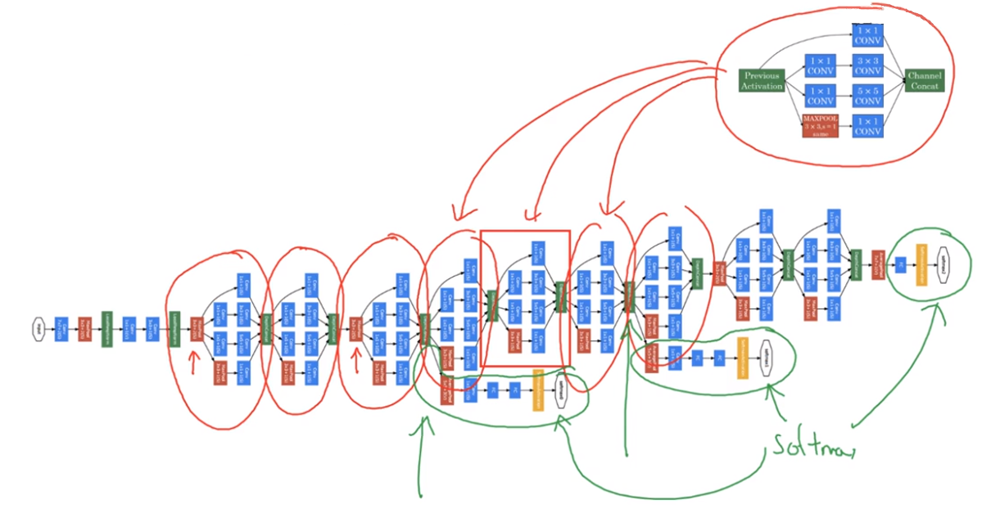
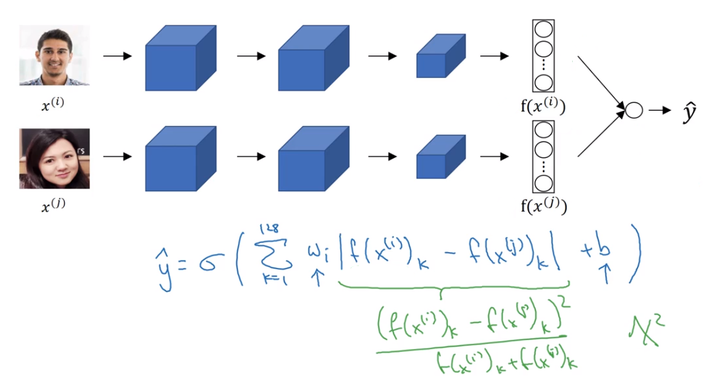

# LeNet-5

**论文**：[LeCun et.al., 1998, Gradient-based learning applied to document recognition]

# AlexNet

**论文**: [Krizhevsky et.al., 2012, ImageNet classification with deep convolution neural networks]

# VGG-16

**论文：** [Simonyan & Zisserman 2015. Very deep convolutional networks for large-scale image recognition]

# Residual Network 残差网络

**论文：** [He et.al., 2015. Deep residual networks for image recognition]

## Residual Block 残差块

$$
\begin{align}
z^{[l+1]} &= W^{[l+1]} a^{[l]} + b^{[l+1]} \\
a^{[l+1]} &= g(z^{[l+1]}) \\
z^{[l+2]} &= W^{[l+2]} a^{[l+1]} + b^{[l+2]} \\
\end{align} \\

\begin{cases}
a^{[l+2]} = g(z^{[l+2]} + a^{[l]}) & a^{[l]}.shape = a^{[l+2]}.shape\\
a^{[l+2]} = g(z^{[l+2]} + W_s^{[l+2]}a^{[l]}) & a^{[l]}.shape \ne a^{[l+2]}.shape\\
\end{cases}
$$

## Residual Network

# Inception Network

**论文:** [Szegedy et.al., 2014. Going deeper with convolutions]

## 减少计算量

### normal convolution

### $1\times 1$ convolution

**使用 $1\times1$ convolution**使用的参数会比normal convolution多，但是**计算量会比normal convolution小很多**

## Inception module

## Inception Network

# ResNet-50 (Residual Network)

## Identity Block

**First component of main path:** 

- The first CONV2D has $F_1$ filters of shape (1,1) and a stride of (1,1). Its padding is "valid" and its name should be `conv_name_base + '2a'`. Use 0 as the seed for the random initialization. 
- The first BatchNorm is normalizing the channels axis.  Its name should be `bn_name_base + '2a'`.
- Then apply the ReLU activation function. This has no name and no hyperparameters. 

**Second component of main path:**

- The second CONV2D has $F_2$ filters of shape $(f,f)$ and a stride of (1,1). Its padding is "same" and its name should be `conv_name_base + '2b'`. Use 0 as the seed for the random initialization. 
- The second BatchNorm is normalizing the channels axis.  Its name should be `bn_name_base + '2b'`.
- Then apply the ReLU activation function. This has no name and no hyperparameters. 

**Third component of main path:**

- The third CONV2D has $F_3$ filters of shape (1,1) and a stride of (1,1). Its padding is "valid" and its name should be `conv_name_base + '2c'`. Use 0 as the seed for the random initialization. 
- The third BatchNorm is normalizing the channels axis.  Its name should be `bn_name_base + '2c'`. Note that there is no ReLU activation function in this component. 

**Final step:** 

- The shortcut and the input are added together.
- Then apply the ReLU activation function. This has no name and no hyperparameters. 

## Convoluntional Block

**First component of main path:**

- The first CONV2D has $F_1$ filters of shape (1,1) and a stride of (s,s). Its padding is "valid" and its name should be `conv_name_base + '2a'`. 
- The first BatchNorm is normalizing the channels axis.  Its name should be `bn_name_base + '2a'`.
- Then apply the ReLU activation function. This has no name and no hyperparameters. 

**Second component of main path:**

- The second CONV2D has $F_2$ filters of (f,f) and a stride of (1,1). Its padding is "same" and it's name should be `conv_name_base + '2b'`.
- The second BatchNorm is normalizing the channels axis.  Its name should be `bn_name_base + '2b'`.
- Then apply the ReLU activation function. This has no name and no hyperparameters. 

**Third component of main path:**

- The third CONV2D has $F_3$ filters of (1,1) and a stride of (1,1). Its padding is "valid" and it's name should be `conv_name_base + '2c'`.
- The third BatchNorm is normalizing the channels axis.  Its name should be `bn_name_base + '2c'`. Note that there is no ReLU activation function in this component. 

**Shortcut path:**

- The CONV2D has $F_3$ filters of shape (1,1) and a stride of (s,s). Its padding is "valid" and its name should be `conv_name_base + '1'`.
- The BatchNorm is normalizing the channels axis.  Its name should be `bn_name_base + '1'`. 

**Final step:** 

- The shortcut and the main path values are added together.
- Then apply the ReLU activation function. This has no name and no hyperparameters. 

## ResNet-50

The details of this ResNet-50 model are:
- **Zero-padding pads the input with a pad of (3,3)**
- **Stage 1:**
    - The 2D Convolution has 64 filters of shape (7,7) and uses a stride of (2,2). Its name is "conv1".
    - BatchNorm is applied to the channels axis of the input.
    - MaxPooling uses a (3,3) window and a (2,2) stride.
- **Stage 2:**
    - The convolutional block uses three set of filters of size [64,64,256], "f" is 3, "s" is 1 and the block is "a".
    - The 2 identity blocks use three set of filters of size [64,64,256], "f" is 3 and the blocks are "b" and "c".
- **Stage 3:**
    - The convolutional block uses three set of filters of size [128,128,512], "f" is 3, "s" is 2 and the block is "a".
    - The 3 identity blocks use three set of filters of size [128,128,512], "f" is 3 and the blocks are "b", "c" and "d".
- **Stage 4:**
    - The convolutional block uses three set of filters of size [256, 256, 1024], "f" is 3, "s" is 2 and the block is "a".
    - The 5 identity blocks use three set of filters of size [256, 256, 1024], "f" is 3 and the blocks are "b", "c", "d", "e" and "f".
- **Stage 5:**
    - The convolutional block uses three set of filters of size [512, 512, 2048], "f" is 3, "s" is 2 and the block is "a".
    - The 2 identity blocks use three set of filters of size [256, 256, 2048], "f" is 3 and the blocks are "b" and "c".
- **The 2D Average Pooling uses a window of shape (2,2) and its name is "avg_pool".**
- **The flatten doesn't have any hyperparameters or name.**
- **The Fully Connected (Dense) layer reduces its input to the number of classes using a softmax activation. Its name should be `'fc' + str(classes)`**.

# Transfer Learning

**数据集较小时**

**数据集较大时**

**数据集很大时**

**当拥有的数据集越大时，让越少的已预训练的层冻结，让越多的层用来训练**

# Data Augmentation 数据增强

## Mirroring

## Random Cropping

## Color shifting

## Implementing distortions during training

# Object Localization 目标定位

$$
y=
\begin{bmatrix}
P_c \\
b_x \\
b_y \\
b_h \\
b_w \\
c_1 \\
c_2 \\
c_3 \\
\end{bmatrix}

\begin{align}
P_c&=图像中是否存在对象(1,2,3)\\
b_x, b_y,b_h,b_w &= 图像对应的Bounding \ Box \\
c_1, c_2, c_3 &=对应与图像中的类别的one-hot编码
\end{align}
$$
**损失函数：**
$$
L(\hat y , y) = 
\begin{cases}
\sum_i (\hat y_i -y_i)^2 , & y=1 \\
(\hat y_1 - y_1)^2, & y=0
\end{cases}
$$

# Landmark Detection 特征点检测

$$
y=
\begin{bmatrix}
isface \\ 
l_{1x} \\
l_{1y} \\
\vdots \\
l_{nx} \\
l_{ny} \\
\end{bmatrix}

total \ (2n+1) \ output \ units \\
$$
损失函数与Object Localization类似

# Object Detection 目标检测

## Sliding Windows

**论文：**[Sermanet et.al., 2014. OverFeat: Integrated recognition, localization and detection using convolutional networks]

滑动窗口无法给出精确的Bounding Box

## YOLO algorithm —— 给出精确Bounding Box

**论文：** [Redmon et.al., 2015, You Only Look Once. Unified real-time object detection]

## Evaluating Object Localization

**IoU: Intersection over Union**

紫色框为预测box， 红色框为标记box， 两者**交集为橙色box**，两者**并集为绿色box**

## Non-max suppression 非极大值抑制

选取$P_c$最大的框

## Anchor Box

用多个Anchor box 来处理多个物体的中心同时在一个格子内的情况，用IoU判断属于那一种Anchor box

# Face Recognition

## One-Shot learning 一次学习

训练一个函数`d(img1, img2)`来获取img1与img2的相似度，而不是直接训练一个分类器

**注：** d表示difference

## Siamese network

**论文：** [Taigman et.al., 2014. DeepFace closing the gap to human level performance]

定义 $ d(x^{(1)}, x^{(2)}) = \left  \|  f(x^{(1)}) - f(x^{(2)}) \right \| ^2_2$

网络将图片encode给出128维的向量，整个网络作为函数$f(x)$

### Triplet Loss 三元组损失函数

**论文：** [Schroff et. al., 2015, FaceNet: A unified embedding for face recognition and clustering]

margin $\alpha$ 为间隔， 目标是让 
$$
\left \| f(A)-f(P) \right \| ^2 +\alpha \le \left \| f(A)-f(N) \right \|^2 \\
即 \quad d(A,P) + \alpha \le d(A,N)
$$
三元组为$(A, P, N) =\begin{cases} A: Anchor \\ P: Positive\  同一人\\ N: Negative\ 不同人\end{cases}$

**三元组损失函数：** 
$$
L(A,P,N) = \max (d(A,P)-d(A,N)+\alpha, \quad0) \\
J = \sum_{i=1}^m L(A^{(i)},P^{(i)},N^{(i)})
$$

## Learning the similarity function

训练一个网络将两张图片encode的编码进行二分类，同一个人为0，否则为1

每个人的照片可以预先通过网络，得到encode $f(x)$， 只需要存储编码后的向量来表示一张人脸，而不必存储原图片。将两个编码的向量输入网络做二分类。

# Neural Style Transfer 神经风格迁移

**论文：** [Gatys et.al., 2015. A neural algorithm of artistic style. Images on slide generated by Justin Johnson]

## Cost Function

初始的G随机生成，之后用梯度下降最小化$J(G)$
$$
J(G) = \alpha J_{content}(C, G)+\beta J_{style}(S,G)
$$

### Content Cost Function

使用一个预先训练的ConvNet（如VGG-16），让$C$和$G$都通过该网络，将其第$l$层用来计算$J_{content}(C,G)$，损失函数为

$$
J_{content}(C,G) = \frac12 \left \| a^{[l](C)} - a^{[l](G)}\right \|^2
$$

式中，$a^{[l](C)}$ 和 $a^{[l](G)}$表示$C$和$G$在ConvNet中的第$l$层的激活层

选择的层$l$不能太深也不能太浅

### Style Cost Function

#### Gram Matrix （Style Matrix）

$S$和$G$都是$n_H \times n_W \times n_C$ 的图像， 其各个通道捕获了不同的特征，Gram Matrix计算各个特征之间的相关性

第$k​$个特征与第$k ' ​$个特征之间的相关性在Gram Matrix中为 
$$
Gram_{k,k'}^{[l](S)} = \sum_{i=1}^{n_H^{[l]}} \sum_{j=1}^{n_W^{[l]}} a_{i,j,k}^{[l](S)} a_{i,j,k'}^{[l](S)} \\
Gram_{k,k'}^{[l](G)} = \sum_{i=1}^{n_H^{[l]}} \sum_{j=1}^{n_W^{[l]}} a_{i,j,k}^{[l](G)} a_{i,j,k'}^{[l](G)} \\
$$
于是风格损失函数可以定义为
$$
J_{style}^{[l]}(S,G) =  \frac1{\left (2n_H^{[l]} n_W^{[l]}n_C^{[l]}\right )^2} \left \| Gram^{[l](S)} - Gram^{[l](G)} \right \|^2
$$
可以在ConvNet的多个层中计算风格损失函数，因此，风格总损失函数为
$$
J_{style}(S,G) = \sum_l \lambda^{[l]} J_{style}^{[l]}(S,G)
$$

