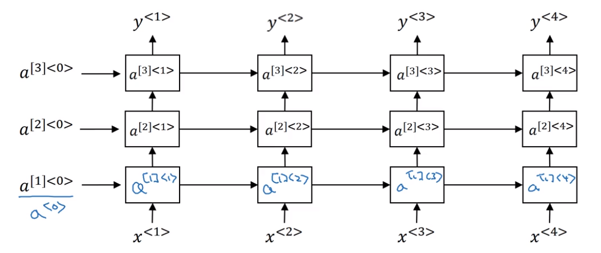
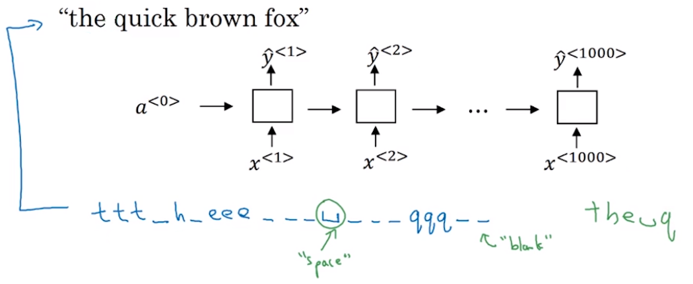

# Notation 符号

$$
\begin{align}
x= &输入序列 \\
y= &输出序列 \\
x^{<t>}= & 输入序列的第t个位置, &t=1,2,\dots, T_x \\
y^{<t>}= & 输出序列的第t个位置, &t=1,2,\dots, T_y \\
x^{(i)}= & 输入的第i个样本
\end{align}
$$

# Representing words （one-hot）

**Vocabulary（词汇表）：** 单词的字典，根据这个词汇表，**每个单词可以表示为一个one-hot向量** 

词汇表中包含一个词`<UNK>`用来表示Unknown word

# Recurrent Neural Networks

$$
\begin{align}
a^{<0>} &=  \overrightarrow 0 \\
a^{<t>} &= g_1 (W_{aa} a^{<t-1>} + W_{ax}x^{<t>}+b_a) \\
\hat y^{<t>} &=g_2(W_{ya} a^{<t>} + b_y)
\end{align}
$$
令 $ W_a = \begin{bmatrix} W_{aa} & W_{ax} \end{bmatrix} $， 即$ W_{aa} $ 与$W_{ax}$ 水平方向的拼接，可将公式简化：
$$
\begin{align}
a^{<0>} &=  \overrightarrow 0 \\
a^{<t>} &= g_1 (W_{aa} a^{<t-1>} + W_{ax}x^{<t>}+b_a) \\ &= g_1 (W_a [a^{<t-1>}, x^{<t>}]+b_a) \\ &= g_1 (W_a \begin{bmatrix} a^{<t-1>}\\ x^{<t>}\end{bmatrix} +b_a) \\
\hat y^{<t>} &=g_2(W_y a^{<t>} + b_y)
\end{align}
$$

## RNN Types

# Language Model

**corpus (语料库):** 大量的文本， 用作训练集

一个句子可以标记为 $y^{<1>} -  y^{<T_y>}$, 特别地将$y^{<T_y>}=\text{<EOS>}$ 用来标记End of Sequence

**注**：将`<EOS>`也加入Vocabulary中

## Character level language model

### Sampling 采样

Sampling是对前一次的输出$\hat y^{<t-1>}$进行采样，将采样结果作为下一个单元的输入$x^{<t>}$，直到输出结果为某个特殊值（如'\n'）时结束。

采样过程如下：

+ 经过softmax后的$\hat y^{<t-1>}$可以看作词汇表中词汇的概率分布，向量的每一个entry对应Vocabulary中每个单词的概率。
+ 根据$\hat y^{<t-1>}$这个概率分布，随机选择一个index，将index这个索引转换为one-hot向量，即可将其作为下一个单元的输入$x^{<t>}$
+ 每次采样结果的序列即采样的输出结果

采样可以做到输入空集而得到一个序列。

模型训练过程第一个输入$x^{<1>}$也是$\vec 0$，第一个输出$\hat y^{<1>}$逼近$y^{<1>}$，即每次输入预测下一次输入的值。输入的$x$为$y$内容相同，只是x为y向右偏移一个时间单位，即$x^{<t+1>}=y^{<t>}$。

### Gradient exploding 梯度爆炸 & Gradient Clipping 梯度裁剪

梯度爆炸是指计算出的梯度的绝对值特别大，这种情况会导致网络难以接近极值点。

解决梯度爆炸的方法是**Clip梯度裁剪**，设置梯度的最大值为$M$，将梯度不在$[-M, M ]$的梯度裁剪至$-M$和$M$ 。

# GRU（Gated Recurrent Unit 门控循环单元）

**论文：** [Cho et.al, 2014. On the properties of neural machine translation: Encoder-decoder approaches] & [Chung et,al, 2014. Empirical Evaluation of Gated Recurrent Neural Networks on Sequence Modeling]

**问题示例：**

- “The cat, which already ate the fish, was full. ”
- “The cats, which already ate the fishes, were full. ”

以上两个句子中，为保证主谓一致，后面使用was还是were由前面的cat和cats决定，但由于中间隔了很长一段话，到was这个位置时，前面cat的信息可能已经丢失

**解决问题：** 长期依赖问题。保持长期序列中的信息，且不会随时间而清除或与预测不相关而清除。将新的输入信息与前面的记忆相结合。

**门的概念：**
$$
\text{Gates} = 
\begin{cases}
\Gamma_u & \text{update gate 更新门} \\
\Gamma_r & \text{reset gate 重置门}
\end{cases}
$$

+ $\Gamma_u$ 更新门用于控制前一时刻的状态信息被带入到当前状态中的程度，更新门的值越大说明前一时刻的状态信息带入越多。
+ $\Gamma_r$ 重置门用于控制忽略前一时刻的状态信息的程度，重置门的值越小说明忽略得越多。
+ 每个门都是一个向量

**GRU结构图:**

$$
\text{GRU}= 
\begin{cases}
\text{input} 
	\begin{cases}
		a^{<t-1>} \\
		x^{<t>} \\
	\end{cases}\\
\text{output}  
	\begin{cases}
		a^{<t>} \\
		c^{<t>} \\
	\end{cases}
\end{cases}\\
\text{在GRU中，} a^{<t>}与c^{<t>}等同
$$

**计算公式：**
$$
\begin{align}
c^{<t-1>} &= a^{<t-1>} \\
\tilde c^{<t>} &= \tanh \left( W_c \left [\Gamma_r *c^{<t-1>},  x \right ] + b_c \right) \\
\Gamma_u &= \sigma \left( W_u \left[ c^{<t-1>}, x^{<t>} \right] + b_u\right)\\
\Gamma_r &= \sigma \left( W_r \left[ c^{<t-1>}, x^{<t>} \right] + b_r\right)\\
c^{<t>} &= \Gamma_u * \tilde c^{<t>} + \left( 1- \Gamma_u \right) * c^{<t-1>} \\
a^{<t>} &= c^{<t>} 
\end{align}
$$

# LSTM (Long Short Term Memory Unit 长短时记忆单元) 

**论文：** [Hochreiter & Schmidhuber 1997. Long short-term memory]

LSTM与GRU相同，用于解决长期依赖问题。但效果比GRU好，出现时间比GRU早，GRU是LSTM的变体。

只要门设置的合适，$c^{<t>}$作为memory cell就可以被传递给后续单元
$$
\text{LSTM}= 
\begin{cases}
\text{input} 
	\begin{cases}
		a^{<t-1>} \\
		x^{<t>} \\
	\end{cases}\\
\text{output}  
	\begin{cases}
		a^{<t>} \\
		c^{<t>} \\
	\end{cases}
\end{cases}\\
\text{在LSTM中，} a^{<t>}与c^{<t>}不同 \\

\begin{align}
&a \text{表示 hidden state， 也常用} h \text{表示} \\
&c \text{表示 cell state} \\
\end{align}
$$

**门的概念：**
$$
\text{Gates} = 
\begin{cases}
	\Gamma_u & \text{update gate 更新门} \\
	\Gamma_f & \text{forget gate 遗忘门} \\
	\Gamma_o & \text{output gate 输出门} \\
\end{cases}
$$
**计算公式：**
$$
\begin{align}
\tilde c^{<t>} &= \tanh \left( W_c \left[ a^{<t-1>}, x^{<t>} \right] + b_c \right) \\
\Gamma_u &= \sigma \left( W_u \left[ a^{<t-1>}, x^{<t>} \right] + b_u\right)\\
\Gamma_f &= \sigma \left( W_f \left[ a^{<t-1>}, x^{<t>} \right] + b_f\right)\\
\Gamma_o &= \sigma \left( W_o \left[ a^{<t-1>}, x^{<t>} \right] + b_o\right)\\
c^{<t>} &= \Gamma_u * \tilde c^{<t>} + \Gamma_f *c^{<t-1>} \\
a^{<t>} &= \Gamma_o * \tanh \left( c^{<t>} \right)
\end{align}
$$

# BRNN (Bidirectional RNN 双向循环神经网络)

BRNN使得在序列的某一点不仅可以获得之前的信息，还可以获取未来的信息。需要一开始就知道一整个序列。

每一个输出 $y^{<t>}$ 由两个值 $\overrightarrow a^{<t>}$ 和 $\overleftarrow a^{<t>}$决定, 
$$
y^{<t>} = g \left( W_y \left[ \overrightarrow a^{<t>}, \overleftarrow a^{<t>} \right] + b_y \right)
$$

# Deep RNN

在竖直方向多增加几层RNN，将下面一层RNN的输出作为输入输入上面一层RNN

对于每一个单元：$$ a^{[l]<t>}  = g \left( W_a^{[l]} \left[ a^{[l]<t-1>}, a^{[l-1]<t>} \right] + b_a^{[l]}\right)$$

+ 通常最多叠到第三层
+ 但最上面的输出 $y^{<t>}$ 还可以再连接一个深层的网络用来预测输出
+ 每一个单元 可以是正常RNN单元，也可以是GRU、LSTM等

# Representing words (word embedding 词嵌入)

**论文：** [Bengio et.al., 2003, A neural probabilistic language model]

词嵌入向量是一个word的特征表示，用一个向量来表示一个word，向量的每一个entry是word的一个特征。

上图仅为示例，每一个词嵌入向量的每一个entry表示一个属性，但在实际上我们并不会特别地去指定词嵌入向量的每一个entry具体代表什么，而是通过训练得到。

## Embedding Matrix 嵌入矩阵

**Notation：**
$$
\begin{align}
o_i &= \text{Vocabulary 中第i个词的one-hot向量} \\
e_i &= \text{Vocabulary 中第i个词的embedding向量} \\
E &= \text{Embedding Matrix 嵌入矩阵}
\end{align}
$$

$e_i$ 存在 $E$ 中，将 $e_i$ 从 $E$ 中取出可利用公式:
$$
e_i = E \cdot o_i
$$
但实际计算中常常直接将$E$中的某一列取出来而不使用点乘

## 词嵌入的特性

**相似**

假定有一个任务从文本中推断出哪些词代表是人的名字（命名实体识别任务），

从第一个句子，可以通过`orange farmer`得知`Sally Johnson`是一个人，给出相似的第二句句子，我们也应该可以从`apple farmer`得知`Robert Lin`是一个人。但如果训练时的corpus里只有`orange farmer`而没有`apple farmer`，那么第二个句子就很难推断出`Robert Lin`是一个人。但如果使用词嵌入向量，由于`apple`和`orange`的词嵌入向量很接近，因此可以判断`apple farmer`和`orange farmer`是类似的，由此也可以推断出`Rober Lin`是一个人。进一步推广，将`apple farmer`改为`durian cultivator`也是可以的，因为`cultivator`与`farmer`的词向量相近。

**类比**

假定已知 Man 对应着 Woman ，问 King 对应着什么词。（我们都知道结果是 Queen， 但咱们去找到它）

方法就是找到某个词对应的词嵌入向量$e_w$，使其满足$e_{\text{man} } -e_{\text{woman}} \approx e_{\text{king}} - e_w$

由此可推导出公式：
$$
w = \arg \max_w sim(e_w,  e_{\text{king}} - e_{\text{man} } + e_{\text{woman}} )
$$
式中，$sim()$为相似度函数，可使用余弦相似度(Cosine similarity):
$$
sim(u,v) = \frac{u^Tv}{\|u\|_2 \|v\|_2}
$$

## 训练词嵌入向量

词嵌入向量的获取可以通过训练语言模型得到。

假定语言模型的目标是填空，则根据空前面的词汇我们可以通过神经网络预测空中应该填入的词，建立神经网络训练。

训练过程中我们通过 $o_i$可以在$E$中获取$e_i$，即$o_i \to E \to e_i$，并将它输入神经网络进行训练。此处$E$也成为了训练的参数。

除了将前面所有的词汇作为输入输入神经网络，跟常见的作法是建立一个窗口（如空格前面的四个词），只将窗口中的词作为输入进行训练。

我们将窗口中的词称作**context（上下文）**， 将要填的空称为**target**，选择context的方法大致由以下几种：

+ context

  + target前面4个词
  + target前面4个词+后面4个词
  + target前面1个词
  + target附近一个词（此方法利用的是Skip-Gram模型的思想，效果很好），如选择target前面的第4个

### word2vec - Skip-Gram Model

+ $ o_i \to E \to e_i \to soft\max \to \hat y$
+ 训练模型让$\hat y$逼近目标的one-hot向量

### Negative Sampling 负采样

+ 选定一个context，把其他所有word都作为target，如果可以作为target则y=1，否则y=0。将所有词汇预先标注好。

+ 训练时，将一个word作为context输入，取出词嵌入向量后输入多个softmax中进行二分类，每个softmax对应一个target，对其可不可以作为target进行二分类

+ 每轮迭代只训练(k+1)个target，其中一个是正样本，另外k个是负样本。其计算量比Skip-Gram要小。

### GloVe Model

**论文：** [Pennington et.al., 2014. GloVe: Global vectors for word representation]

定义一个target的context为target前后2个词汇，则$X_{i,j}$为word j在以word i为target的context中出现的次数。遍历corpus获得所有的$X_{i,j}$。得到的$X$是一个对称矩阵，即$X_{i,j}=X_{j,i}$。

**Cost Function:**
$$
J = \sum_i^N \sum_j^N f(X_{i,j}) \left( e_i^T e_j + b_i + b_j - \log(X_{i,j})\right)^2
$$
最小化$J$训练所有$e_i, b_i$

# Sentiment classification 情绪分类

识别句子中的情感

使用**RNN+word embedding**识别

# Debiasing Word Embeddings 词嵌入除偏

**论文：** [Bolukbasi et.al., 2016. Man is to computer programmer as woman is to homemaker? Debiasing word embeddings]
$$
\begin{align}
\text{ Man:} & \text{Woman} & as && \text{King:}& \text{Queue} \\
\text{ Man:} & \text{Computer_programmer} & as && \text{Woman:}& \text{Homemaker} \\
\text{ Father:} & \text{Doctor} & as && \text{Mother:}& \text{Nurse} \\
\end{align}
$$
词嵌入根据训练时的文本的情况会出现bias偏见，如性别歧视，种族歧视等的，可以后续消除bias

**步骤：**

1. **Identify bias direction**

   
   $$
   \begin{cases}
   	\begin{matrix}
   		e_{he} - e_{she} \\
   		\vdots \\
   		e_{male} - e_{female} \\
   	\end{matrix}	
   \end{cases}
    \to  \text{averge} \to \text{bias direction(偏见趋势)}
   $$
   与bias direction(偏见趋势)垂直的方向都为non-bias direction(无偏见趋势)，具体表示为non-bias direction的向量与bias direction方向的向量垂直，所有non-bias direction构成一个超平面

2. **Neutralize**(中和): For every word that is not definitional(比如doctor等不带性别倾向的词), project to get rid of bias

   

   将本应该无偏见的词沿偏见趋势的方向移到无偏见趋势的轴（超平面）上，这样就消除了bias。

   假定要除偏的词的词嵌入向量为$e$, 偏见趋势为$g$，则除去bias的公式为：
   $$
   e^{\text{bias_component}} = \frac{e \cdot g}{\| g \|^2_2} * g \\
   e^{\text{debiased}} = e-e^{\text{bias_component}}
   $$

3. **Equalize pairs**(均衡)

   使得$(e_{he}, e_{she}), \cdots, (e_{male}, e_{female})$每一对中两个词嵌入向量离non-bias directioin（超平面）的距离相等

   假设偏见偏见趋势为$g$, 则均衡的公式为：
   $$
   \begin{align} 
   \mu &= \frac{e_{w1} + e_{w2}}{2} \\ 
   \mu_B &= \frac{\mu \cdot g}{||g||_2^2} * g \\
   \mu_{\perp} &= \mu - \mu_B \\
   e_{w1B} &= \frac{e_{w1} \cdot g}{||g||_2^2}*g \\
   e_{w2B} &= \frac{e_{w2} \cdot g}{||g||_2^2}*g \\
   e_{w1B}^{corrected} &= \sqrt{ |{1 - ||\mu_{\perp} ||^2_2}|} * \frac{e_{\text{w1B}} - \mu_B} {||(e_{w1} - \mu_{\perp}) - \mu_B||} \\
   e_{w2B}^{corrected} &= \sqrt{ |{1 - ||\mu_{\perp} ||^2_2}|} * \frac{e_{\text{w2B}} - \mu_B} {||(e_{w2} - \mu_{\perp}) - \mu_B||} \\
   e_1 &= e_{w1B}^{corrected} + \mu_{\perp} \\
   e_2 &= e_{w2B}^{corrected} + \mu_{\perp} \\
   \end{align}
   $$

# Sequence to Sequence Model

**论文：** [Sutskever et. al., 2014. Sequence to sequence learning with neural networks] & [Cho et. al., 2014. Learning phrase representations using RNN encoder-decoder for statistical machine translation]

seq2seq model can be used in machine translation.

## Beam Search 集束搜索

在生成$y^{<t>}$的过程中，如果decoder使用Sampling来决定下一个状态的输入，其随机采样的过程会使得$(y^{<1>}, y^{<2>}, \cdots, y^{<T_y>})$有多个可能的结果。

为此需要选择一个最好的结果使得$P(y^{<1>},\cdots,y^{<T_y>} | x)$概率达到最大，即
$$
\arg \max_y \prod_{t=1}^{T_y} P(y^{<t>} | x, y^{<1>}, \cdots,y^{<t-1>})
$$

集束搜索的参数为$B$，表示集束的个数。

假设$B=3$， 则

+ 在得到$\hat y^{<1>}$后选择$\hat y^{<1>}$中概率最大的3个word，其概率表示为$P(y^{<1>}| x)$ 。
+ 复制网络，将3个word依此作为下一个状态的输入，得到3个$\hat y^{<2>}$，其概率表示为$P(y^{<2>} | x,y^{<1>})$，将其与对应的$P(y^{<1>}|x)$相乘，得到$P(y^{<1>}, y^{<2>} | x)=P(y^{<1>}| x) * P(y^{<2>} | x,y^{<1>})$。
+ 选择使得$P(y^{<1>}, y^{<2>} | x)$最大的3个word，于是网络只剩下3个分支，复制网络，再将3个word传入下一个状态，以此类推。

**改进：**

由于$\arg \max_y \prod_{t=1}^{T_y} P(y^{<t>} | x, y^{<1>}, \cdots,y^{<t-1>})$将多个小于1的小数相乘，容易发生数值下溢，因此对其做一些改进：
$$
\arg \max_y \sum_{t=1}^{T_y} \log P(y^{<t>} | x, y^{<1>}, \cdots,y^{<t-1>})
$$
除了数值下移，上式当$T_y$越长时，乘的0~1的小数越多，概率$P(y|x)$越小，因此使得网络更偏向于选择$T_y$较小的结果。对其进行修正：
$$
\arg \max_y \frac1{T_y} \sum_{t=1}^{T_y} \log P(y^{<t>} | x, y^{<1>}, \cdots,y^{<t-1>})
$$
但实际中增加一个参数$\alpha$控制归一化的程度:
$$
\arg \max_y \frac1{T_y^\alpha} \sum_{t=1}^{T_y} \log P(y^{<t>} | x, y^{<1>}, \cdots,y^{<t-1>})
$$
实验数值在$\alpha=0.7$时得到了不错的效果。

## Bleu Score

用于评估翻译的准确程度。
$$
\begin{align}
&\text{French}:& \text{Le chat est sur le tapis.} \\
&\text{Reference 1}:& \text{The cat is on the mat.} \\
&\text{Reference 2}:& \text{There is a cat on the mat.} \\
&\text{Machine Translation}:& \text{The cat the cat on the mat.} \\
\end{align}
$$
Reference 1 和 Reference 2 为人工翻译的结果。
$$
Count(word) = 
\begin{cases}
0, &\text{if word 不在 Reference 中} \\
机器翻译结果中word出现的次数, &\text{if word 在 Reference 中}
\end{cases}
$$

$$
Count_{clip}(word) =
\begin{cases}
0, &\text{if word 不在 Reference 中} \\
\min(机器翻译结果中word出现的次数, \quad word在Reference中最多的出现次数), &\text{if word 在 Reference 中}
\end{cases}
$$

### n-gram

前面计算时word是一个单词，如"The","cat". 将其拓展成n个连续的单词，即n-gram, 如bigram为"The cat", "cat the", "cat on"。

由此计算
$$
p_n =\frac{ \sum_{\text{n-gram}\in \hat y} Count_{clip}(\text{n-gram}) }{ \sum_{\text{n-gram}\in \hat y} Count(\text{n-gram}) }
$$

$$
\text{Bleu score} = BP*exp(\frac14 \sum_{n=1}^4 p_n) \\

BP = 
\begin{cases}
1,& \text{if MT_output_length>Reference_output_length} \\
exp(1-\frac{\text{MT_output_length}}{\text{Reference_output_length}}),&\text{otherwise}
\end{cases}
$$

# Image to Sequence Model

**论文：** [Mao et.al., 2014. Deep captioning with multimodal recurrent neural networks]

& [Vinyals et.al., 2014. Show and tell: Neural image caption generator]

& [Karpathy and Li, 2015. Deep visual-semantic alignments for generating image descriptions]

# Attention Model 注意力模型

**论文:** [Bahdanau et.al., 2014. Neural machine translation by jointly learning to align and translate] & [Xu et.al, 2015. Show attention and tell: neural image caption generation with visual attention]

$$
a^{<t'>} = [\overrightarrow a^{<t'>} , \overleftarrow a^{<t'>}] \\
\alpha^{<t,t'>} = \text{amount of attention }y^{<t>}\text{ should pay to }a^{<t'>} \\
\alpha^{<t,t'>} = \frac{\exp\left( e^{<t,t'>} \right)}{\sum_{t'=1}^{T_x} \exp \left(e^{<t,t'>} \right)} \\ \ \\
c^{<t>} = \sum_{t'} \alpha^{<t, t'>} a^{<t'>}
$$

# Speech Recognition 语音识别

使用注意力模型进行语音识别：

使用Connectionist Temporal Classification进行语音识别：

# Trigger Word Detection

可以将语音表示为spectrogram的image，其横坐标为时间，纵坐标为频率，spectrogram上每个点表示的是某一时刻某一频率的强度。

Spectrogram of an audio recording, where the color shows the degree to which different frequencies are present (loud) in the audio at different points in time. Green squares means a certain frequency is more active or more present in the audio clip (louder); blue squares denote less active frequencies

上图触发词为"activate",label在activate说完之后开始五十个时间步长标记label为1。

