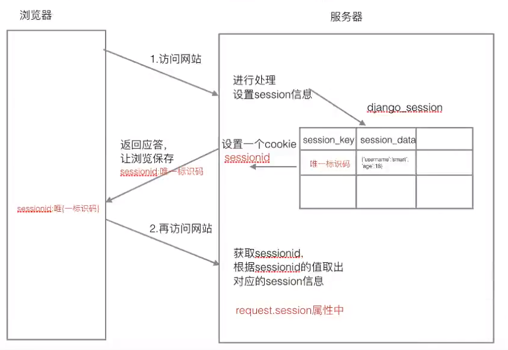

# python Django框架

# MVT 概念


**M(model 模型)**: 和数据库交互

**V(View 视图):** 接收请求，进行处理，与M和T交互，返回应答

**T(Template 模板)**: 产生html页面

# 文档

**中文文档翻译**： https://yiyibooks.cn/

# 虚拟环境

虚拟环境是真实python环境的复制版本

在虚拟环境下用pip安装包会将某个python安装在

**安装命令：**

```shell
sudo pip install virtualenv # 安装虚拟环境
sudo pip install virtualenvwrapper # 安装虚拟环境扩展包

# 编辑home目录下的.bashrc文件，加入以下两行
export WORKON_HOME=$HOME/.virtualenvs
source /usr/local/bin/virtualwarpper.sh

#使用 source .bashrc 使其生效
```

**创建/删除虚拟环境**：

```shell
# 创建
mkvirtualenv name    # python2的虚拟环境, name为虚拟环境名
mkvirtualenv -p python3 name  # python3的虚拟环境

# 删除
rmvirtualenv name
```

**进入/退出虚拟环境：**

```shell
workon name # 进入
deactivate  # 退出
```

# pip

**安装指定版本：**

```
pip install django==1.8.2
```

**查看虚拟环境下python安装了哪些包**：

```shell
pip list
pip freeze
```

# 创建项目

```shell
django-admin startproject test1
```

```python
# tree
test1 <dir>
-- manage.py  # 项目的管理文件
-- test1 <dir>
---- __init__.py # 说明test1是一个python包
---- settings.py # 项目的配置文件
---- urls.py     # 进行url路由的设置
---- wsgi.py     # 服务器和Django交互的接口
```

一个项目由很多个**应用**组成，每个应用完成一个特定的功能

**创建应用:**

```shell
python manage.py startapp booktest
# 创建应用时需要先进入项目文件夹
```

```python
# tree
booktest <dir>
-- admin.py    # 网站后台管理相关
-- __init__.py # 说明booktest是一个python模块
-- models.py   # 和数据库相关的内容
-- tests.py    # 测试代码
-- views.py    # 接收请求，进行处理，与M和T交互，返回应答（定义处理函数,视图函数）
-- migrations <dir> # 迁移文件文件夹
---- __init__.py # 说明migrations是一个python模块
```

**在setting.py中注册应用:**

```python
# setting中

INSTALLED_APPS = (
	# ...
    'booktest',  # 加上这一项对应用进行注册
)
```

# 运行项目

```shell
python manage.py runserver
```

# ORM


django内嵌了ORM框架，ORM**可将类和数据表对应起来，只需要通过类和对象就可以对数据表进行操作**

设计模型类

**ORM另一个作用**： 根据设计的类生成数据库中的表

# 模型类

## 创建模型类

```python
# models.py中

from django.db import models

# Create your models here.

# 图书类
class BookInfo(models.Model): # 继承models.Model
	'''图书模型类'''

	# 图书名称， CharField说明是一个字符串， max_length指定最大长度
	btitle = models.CharField(max_length=20)

	# 出版日期
	bpub_date = models.DateField()
    
    def __str__(self):
        # 返回图书标题
        return self.btitle
```

```python
# 英雄人物类
class HeroInfo(models.Model):

	hname = models.CharField(max_length=20)

	hgender = models.BooleanField(default=False)

	hcomment = models.CharField(max_length=128)

    # 关系属性，建立 BookInfo和HeroInfo 一对多的关系
    # 在对应表中的字段名：hbook_id
	hbook = models.ForeignKey('BookInfo', on_delete=models.CASCADE) 
```


## 从模型类生成表

**生成迁移文件**

```shell
python manage.py makemigrations
# 生成的迁移文件在 migrations文件夹 下
```

**执行迁移生成表**

```shell
python manage.py migrate
```

生成表名默认格式：`应用名_模型类名小写`

## 通过模型类操纵数据表

**进入项目shell**

```shell
python manage.py shell
```

**演示**

```python
# 添加
>>> from booktest.models import BookInfo
>>> b = BookInfo() # 创建实例
>>> b.btitle = "hello world"  # 设置btitle
>>> from datetime import date
>>> b.bpub_date = date(1990,1,1) # 设置bpub_date
>>> b.save() # 将b保存到表中

# 修改
>>> b2 = BookInfo.objects.get(id=1) # 获取
>>> type(b2)
<class 'booktest.models.BookInfo'>
>>> b2.bpub_date = date(1990,10,10) # 修改bpub_date
>>> b2.save() # 将b2更新到表中

# 删除
>>> b2.delete() # 将b2从表中删除
```

```python
# 创建一个BookInfo
>>> from booktest.models import BookInfo, HeroInfo
>>> from datetime import date
>>> b = BookInfo()
>>> b.btitle = "book1"
>>> b.bpub_date = date(1990,1,1)
>>> b.save()

# 创建一个HeroInfo
>>> h = HeroInfo()
>>> h.hname = "name"
>>> h.hgender = False
>>> h.hcomment = "comment of the hero"
>>> h.hbook = b
>>> h.save()

# 创建另一个HeroInfo
>>> h2 = HeroInfo()
>>> h2.hname = "another name"
>>> h2.hgender = False
>>> h2.hcomment = "comment of another hero"
>>> h2.hbook = b 
>>> h2.save()

# 查询包含b的所有HeroInfo，小写模型类名_set
>>> b.heroinfo_set.all()
<QuerySet [<HeroInfo: HeroInfo object (1)>, <HeroInfo: HeroInfo object (2)>]>
```

**查询表里的所有内容**

```python
BookInfo.objects.all()
HeroInfo.objects.all()
```

**查询表里的特定内容**

```python
BookInfo.objects.get(id=1) # id =1,2,...
BookInfo.objects.get(btitle='book1') 
```

# 后台管理

**本地化**

```python
# setting.py

# ...

LANGUAGE_CODE = 'zh-hans' # 使用中文

TIME_ZONE = 'Asia/Shanghai' # 中国上海时区
```

**创建管理员**

```shell
python manage.py createsuperuser
```

**打开后台管理**

```
网址/admin
```

**注册模型类**

```python
# admin.py

from django.contrib import admin
from booktest.models import BookInfo, HeroInfo
# Register your models here.

admin.site.register(BookInfo)
admin.site.register(HeroInfo)
```

修改后刷新后台管理的页面可管理模型类

**自定义管理界面**

```python
# admin.py

from django.contrib import admin
from booktest.models import BookInfo, HeroInfo
# Register your models here.

# 自定义模型管理类
class BookInfoAdmin(admin.ModelAdmin):
	'''图书模型管理类'''
	list_display = ['id', 'btitle', 'bpub_date']


class HeroInfoAdmin(admin.ModelAdmin):

	list_display = ['id', 'hname', 'hgender', 'hcomment', 'hbook'] 
    # 也可用
    # list_display = ['id', 'hname', 'hgender', 'hcomment', 'hbook_id'] 
    
# 注册模型类
admin.site.register(BookInfo, BookInfoAdmin)
admin.site.register(HeroInfo, HeroInfoAdmin)
```

修改后刷新即可

# 视图

**创建视图函数**

```python
# view.py

from django.shortcuts import render
from django.http import HttpResponse

# Create your views here.

# http://网址/index
def index(request):

	# 进行处理
    
	return HttpResponse("返回去显示的文本，如html")
```

**进行url配置**

```python
# 在 应用booktest 下创建urls.py
# booktest/urls.py

from django.urls import path
from booktest import views

urlpatterns = [
	# 通过url/path函数设置路由配置项
	path('index/', views.index), # 建立index网址与 index函数的映射
]
```

```python
# 在test1中包含booktest的urls
# test1/urls.py

from django.contrib import admin
from django.urls import path, include

import booktest

urlpatterns = [
    path('admin/', admin.site.urls),
    path('', include('booktest.urls')), # 使其包含booktest下的url配置文件
]
```

按顺序查找，直到找到，每次找到将匹配的字符从字符串中除去

# 模板

在项目文件夹test1下**新建templates文件夹**（与booktest同级）

**配置模板目录**

```python
# setting.py

# ...

TEMPLATES = [
    {
        'BACKEND': 'django.template.backends.django.DjangoTemplates',
        'DIRS': [os.path.join(BASE_DIR, 'templates')], # 设置模板目录文件夹，后面用'templates'而不是'templates/'，否则会出错
        'APP_DIRS': True,
        'OPTIONS': {
            'context_processors': [
                'django.template.context_processors.debug',
                'django.template.context_processors.request',
                'django.contrib.auth.context_processors.auth',
                'django.contrib.messages.context_processors.messages',
            ],
        },
    },
]
```

在templates**新建templates/booktest/index.html作为模板文件**

```html
<!--templates/booktest/index.html-->

<!DOCTYPE html>
<html lang="en">
<head>
	<meta charset="UTF-8">
	<title> 模板文件 </title>
</head>
<body>
	<hl> 这是一个模板文件 </hl>
	
	使用模板变量：<br/>
	{{ content }} <br/>
	
	使用列表：<br/>
	{{ list }} <br/>

	for循环:<br/>
	<ul>
		
			<li> {{ i }} </li>
		
	</ul>

</body>
</html>
```

**修改views.py**

```python
from django.shortcuts import render

# Create your views here.

# http://网址/index
def index(request):

	# 进行处理
	# return HttpResponse("返回去显示的文本，如html")
	context_dict = {
		'content': '模板变量', 
		'list': list(range(1,10))
	}
	return render(request, 'booktest/index.html', context_dict)
```

```python
# 其中的render等效于

from django.http import HttpResponse
from django.template import loader, RequestContext

def my_render(request, template_path, context_dict={}):
	'''使用模板文件'''
	# 1. 加载模板文件，模板对象
	temp = loader.get_template(template_path)
	# 2. 定义模板上下文：给模板传递数据
	context = RequestContext(request, context_dict)
	# 3. 模板渲染：产生标准的html内容
	result_html = temp.render(context)
	# 4. 返回给浏览器
	return HttpResponse(result_html)
```

## MVT案例

```html
<!-- templates/booktest/show_books.html -->

<!DOCTYPE html>
<html lang="en">
<head>
	<meta charset="UTF-8">
	<title> 显示图书信息 </title>
</head>
<body>
	<h1> 图书目录 </h1>
	
	<ul>
		
        	<!-- href处'/books'加斜杠将访问http://127.0.0.1:8000/books, 不加斜杠即'books'将访问'当前网页地址/books' -->
			<li> <a href="/books/{{ book.id }}"> {{ book.btitle }} </a> </li> 
		
			<li> 没有图书 </li>
			
	</ul>

</body>
</html>
```

```html
<!-- templates/booktest/detail.html -->

<!DOCTYPE html>
<html lang="en">
<head>
	<meta charset="UTF-8">
	<title> 显示英雄信息 </title>
</head>
<body>
	<h1> 与图书 {{ book.btitle }} 相关的英雄如下： </h1>
	
	<ul>
		
			<li> {{ hero.hname }} -- {{ hero.hcomment }} </li>
		
			<li> 没有英雄 </li>
			
	</ul>

</body>
</html>
```

```python
# booktest/views.py

from django.shortcuts import render
from booktest.models import BookInfo

# Create your views here.

# http://网址/index
def index(request):

	# 进行处理
	# return HttpResponse("返回去显示的文本，如html")
	context_dict = {
		'content': '模板变量', 
		'list': list(range(1,10))
	}
	return render(request, 'booktest/index.html', context_dict)

def show_books(request):
	'''显示图书的信息'''
	books = BookInfo.objects.all()
	context_dict = {
		'books': books
	}
	return render(request, 'booktest/show_books.html', context_dict)

def detail(request, book_id):
	'''根据book_id查询与其关联的英雄信息'''
	book = BookInfo.objects.get(id=book_id)

	heros = book.heroinfo_set.all()
	context_dict = {
		'book': book,
		'heros' : heros
	}
	return render(request, 'booktest/detail.html', context_dict)
```

```python
# booktest/urls.py
# url配置

from django.urls import path
from booktest import views

urlpatterns = [
	# 通过url/path函数设置路由配置项
	path('index/', views.index), # 建立index网址与 index函数的映射
	path('books/', views.show_books),
	path('books/<int:book_id>/', views.detail), # 用<int:book_id>传递参数
]
```

# MySQL 数据库配置

**进入MySQL：**

```shell
mysql -uroot -p # 进入MySQL
```

**MySQL指令：**

```
show databases; //显示所有数据库
create database database_name charset=utf8; // 创建数据库database_name
use database_name; // 切换到数据库database_name
show tables; // 显示当前所在数据库中的所有表
```

要在Django项目中使用MySQL数据库需先在MySQL中创建好数据库。

**修改Django项目使用的数据库：**

```python
# settings.py

# ...
DATABASES = {
    'default': {
        'ENGINE': 'django.db.backends.mysql',
        'NAME': 'database_test',  # 使用的数据库的名字
        'USER': 'root',           # MySQL中的用户名
        'PASSWORD': '123456',     # 登录MySQL的密码
        'HOST': 'localhost',      # MySQL数据库所在的主机的ip
        'PORT': 3306,             # MySQL服务的端口号
    }
}
```

**在 `test1/__init__.py`中修改**

```python
# test1/__init__.py

import pymysql
pymysql.install_as_MySQLdb()
```

**迁移表（当之前使用的是别的数据库时）：**

```shell
python manage.py migrate
```

**需重新创建管理员账号**

```shell
python manage.py createsuperuser
```

# 网页重定向

重定向：用户访问某网页如/create，视图处理过让浏览器访问另一网页


```python
# views.py
from django.shortcuts import render, redirect
from django.http import HttpResponseRedirect
from booktest.models import BookInfo

def index(request):
    # ...
    return render(request, 'booktest/index.html', context)

def create(request):
    # 创建一本新的书
    book = BookInfo()
    book.name = '...'
    # ... 设置图书的其他属性
    book.save() 把book保存到数据库中
    
    # 重定向到"http://127.0.0.1:8000/index"
    return HttpResponseRedirect('/index')

def delete(request, book_id):
    # 删除id为book_id的图书
    book = BookInfo.objects.get(id=book_id)
    book.delete()
    
    # 重定向到"http://127.0.0.1:8000/index"
    return redirect('/index')  # 重定向的另一种写法
```

# 字段属性和选项

**模型类属性命名限制**：

+ 不能是python的保留关键字
+ 不允许使用连续的下划线，这是由Django的查询方式决定的
+ 定义属性时需要指定字段类型，通过字段类型的参数指定选项，语法如下：
  + 属性名 = models.字段类型(选项)

**字段类型:**

| 类型                                               | 描述                                                         |
| -------------------------------------------------- | ------------------------------------------------------------ |
| AutoField                                          | 自动增长的IntegerField，通常不用指定，不指定时Django会自动创建属性名为`id`的自动增长属性 |
| BooleanField                                       | 布尔字段，值为`True`或`False`                                |
| NullBooleanField                                   | 支持`Null`,`True`,`False`三种值                              |
| CharField(max_length)                              | 字符串，参数`max_length`表示最大字符个数                     |
| TextField                                          | 大文本字段，一般超过4000个字                                 |
| IntegerField                                       | 整数                                                         |
| DecimalField(max_digits=None, decimal_places=None) | 十进制浮点数(精确)。参数`max_digits`表示总位数。参数`decimal_places`表示小数位数 |
| FloatField                                         | 浮点数。参数同上。                                           |
| DateField(auto_now=False, auto_now_add=False)      | 日期。 参数`auto_now`为`True`表示每次保存`book.save()`时自动设置该字段为当前时间，即最后一次修改的时间戳。参数`auto_now_add`为`True`表示创建时自动设置当前时间，即创建的时间戳。**`auto_now`与`auto_now_add`不可同时使用**。 |
| TimeField                                          | 时间。参数同DateField                                        |
| DateTimeField                                      | 日期时间，参数同DateField                                    |
| FileField                                          | 上传文件字段                                                 |
| ImageField                                         | 继承于FileField，对上传的内容进行校验，确保是有效的图片      |

**选项：**

| 选项        | 描述                                              |
| ----------- | ------------------------------------------------- |
| default     | 默认值                                            |
| primary_key | 若为`True`，则该字段会成为模型的主键，默认`False` |
| unique      | 若为`True`，则该字段在表中不能重复，默认`False`   |
| db_index    | 若为`True`，则表中会为该字段创建索引，默认`False` |
| db_column   | 字段的名称，若未指定，则使用属性的名称            |
| null        | 若为`True`，则数据库中该项允许为空，默认`False`   |
| blank       | 若为`True`，则该字段允许为空白，默认`False`       |

`null`与`blank`的差别：`null`是数据库范畴的概念，`blank`与后台管理有关，后台管理时该字段可为空。

# 查询函数

通过`模型类.objects`属性可以调用以下函数实现对模型类对应数据表的查询。

| 函数名     | 功能                                       | 返回值     | 说明                                                         |
| ---------- | ------------------------------------------ | ---------- | ------------------------------------------------------------ |
| `get`      | 返回表中满足条件的**一条且只能有一条**数据 | 模型类对象 | 参数写查询条件。若查到多条数据，则抛出异常`MultipleObjectsReturned`。若查不到数据，则抛出异常`DoesNotExist` |
| `all`      | 返回模型类对应表格中的**所有数据**         | QuerySet   | 返回的QuerySet可以遍历取出元素                               |
| `filter`   | 返回**满足条件**的所有数据                 | QuerySet   | 参数写查询条件                                               |
| `exclude`  | 返回**不满足条件**的所有数据               | QuerySet   | 参数写查询条件                                               |
| `order_by` | 对查询结果进行排序                         | QuerySet   |                                                              |

**查询条件：**

条件格式： `模型类属性名__条件名=值`

```python
# 判等 条件名：exact
BookInfo.objects.get(id=1)
BookInfo.objects.get(id__exact=1) # 作用同上

# 包含 条件名：contains
BookInfo.objects.filter(name__contains='my')

# 以某个字符串结尾 条件名：endswith
BookInfo.objects.filter(name__endswith='here')

# 以某个字符串开头 条件名：startswith
BookInfo.objects.filter(name__startswith='my')

# 空查询 条件名：isnull
BookInfo.objects.filter(name__isnull=False) # 查询书名不为空的书

# 范围查询 条件名：in
BookInfo.objects.filter(id__in=[1,3,5]) # 查询id为1或3或5的图书

# 比较查询 条件名：gt, lt, gte, lte
BookInfo.objects.filter(id__gt=3) # 查询id>3的图书
BookInfo.objects.filter(publish_date__gt=date(2000,1,1)) # 查询出版日期晚于2000.1.1的图书

# 日期查询 条件名：year, month, day
BookInfo.objects.filter(publish_date__year=2000) 

# 可以同时指定多个查询条件
BookInfo.objects.filter(publish_date__year=2000, id__gt=30, id__lt=50)
```

示例:

**`get`:**  

```python
book = BookInfo.objects.get(id=3)
```

**`all`:**

```python
books = BookInfo.objects.all()
```

**`filter`:**

```python
books = BookInfo.objects.filter(name='book name')
```

**`exclude`:**

```python
books = BookInfo.objects.filter(name='book name')
```

**`order_by`:**

```python
books = BookInfo.objects.order_by('id') # 将所有图书按id升序排序
books = BookInfo.objects.all().order_by('id') # 同上
books = BookInfo.objects.filter(name='book name').order_by('publish_date') # 将所有书名为'book name'的书按'publish_date`升序排序

# 降序只需在属性名前加'-'号
books = BookInfo.objects.order_by('-id') # 将所有图书按id降序排序

# 也可按多个key排序
books = BookInfo.objects.order_by('name','id')
```

## Q 对象 ：查询条件的复合

表示查询时条件之间的逻辑关系。 and or not 可用Q对象进行 `& | ~`操作。

```python
from django.db.models import Q
```

```python
# and
BookInfo.objects.filter(id__gt=3, name__contains='my')
BookInfo.objects.filter(Q(id__gt=3) & Q(name__contains='my'))

# or
BookInfo.objects.filter(Q(id__gt=3) | Q(name__contains='my'))

# not
BookInfo.objects.filter(~Q(id__gt=3))
```

## F对象 ：查询条件为类属性之间的比较

```python
from django.db.models import F
```

```python
# 查询图书阅读量大于两倍评论量的图书
BookInfo.objects.filter(bread_gt=2*F('bcomment'))
```

## 聚合函数

聚合类: `Sum Count Avg Max Min`

聚合函数: `aggregate` , 使用这个函数来使用聚合，返回一个字典

```python
from django.db.models import Sum, Count, Avg, Max, Min
```

```python
# 所有图书的数量
BookInfo.objects.all().aggregate(Count(id))
BookInfo.obejcts.all().count() # 只有count直接的函数可以用
# 返回 {'id__count': 5}

# 所有图书的阅读量的总和
BookInfo.objects.all().aggregate(Sum('bread'))
# 返回 {'bread__sum': 126}
```

## 查询集 QuerySet

**查询集特性：**

+ **惰性查询：** 只有在实际使用查询集中的数据的时候才会发生对数据库的真正查询
+ **缓存：** 当使用的是同一个查询集时，第一次的时候会发生实际数据库的查询，然后把结果缓存进来，之后再使用这个查询集时，使用的是缓存中的结果。

**限制查询集：**

可以对一个查询集**通过取下标进行切片**。

```python
books = BookInfo.objects.all()
books_part = books[1:10] # 切片得到新的查询集,下标不允许用负数来表示倒数第几个
```

**取出查询集中一条数据：**

| 方式               | 说明                                                   |
| ------------------ | ------------------------------------------------------ |
| `books[0]`         | 如果`books[0]`不存在，则抛出`IndexError`异常           |
| `books[0:1].get()` | 如果`books[0:1].get()`不存在，则抛出`DoesNotExist`异常 |

可用`books.exists()==False`来判断一个QuerySet是否为空

模型类关系


模型类关系


# 模型类关系

**一对多：**

`models.ForeignKey()`, 定义在多的类中

**多对多：**

`models.ManyToManyField()` 定义在哪个类都可以

**一对一：**

`models.OneToOneField()` 定义在哪个类都可以

# 模型关联查询（一对多）

假设`BookInfo`为一类，`HeroInfo`为多类，即`BookInfo`与`HeroInfo`为一对多的关系， 多类中定义的建立关联的类属性称为关联属性。

```python
# 查询图书id为1的所有英雄
# 多类的查询条件： 关联属性名
HeroInfo.objects.filter(hbook__id=1) 

# 查询id小于3的英雄所属的图书
BookInfo.objects.get(heroinfo__id__lt=3)
```

# 模型插入、更新、删除

插入和更新: `book.save()`

删除: `book.delete()`

# 模型自关联

一对多关系关联到本身，使得本身之间存在上下级关系。

```python
def AreaInfo(models.Model):
    area_parent = models.ForeignKey('self', null=True, blank=True)
```

找到上下级

```python
parent = area.area_parent           #上级, 无上级为None
children = area.areainfo_set.all()  #下级
```

# 模型管理器

`BookInfo.objects`中`objects`是django为`BookInfo`模型类自动创建的模型管理类`models.Manager`对象

除了使用我们也可以自定义模型管理类对象

```python
class BookInfo(models.Model):
    """图书模型类"""
    title = models.CharField(max_length=20)
    
    is_delete = models.BooleanField(default=False) # 删除标签，删除时不真的删除，只将该标签置为True
    
    objects = BookInfoManager() # 自定义的模型管理类将覆盖默认生成的模型管理类
    
    def delete(self, using=None, keep_parents=False):
        """ 删除操作只将is_delete置True而不真的删除 """
        is_delete = True
        self.save() # 更新到数据库中
    
class BookInfoManager(models.Manager):
    """图书模型管理类"""
    
    def all(self):
        """ 只将is_delete为False的所有图书返回 """
        books = super().all()
        books = books.filter(is_delete==False)
        return books
    
    def create_book(self, title):
        """创建一本图书并加到数据库中"""
        book = self.model() # 相当于book=BookInfo()， self.model返回其管理的模型类的类名
        book.title = title
        book.save() # 保存到数据库中
        return book
```

**使用：**

```python
books = BookInfo.objects.all() # 只返回is_delete为False的图书

book = BookInfo.objects.create_book('book name') # 创建一本新书并加到数据库中
# django已经自动实现了create_book的功能，可用以下指令代替
book = BookInfo.objects.create(title='book name') # 要求参数必须通过关键字参数传递
```

# 模型元选项

django中模型类的在数据库中的表名默认为： `应用名小写_模型类名小写`。

如果应用名发生变化，则该表将无法使用，为此需要让模型类表名不依赖于应用名。

**方法：**在模型类中创建元类Meta，给它设置一属性db_table指定表名。

```python
class BookInfo(models.Model):
    # ...
    
    class Meta: # 元类
        db_table = 'bookinfo' # 指定模型类对应的表名
```

# 错误视图 404 500

默认情况下`DEBUG=True`，网站如果找不到路径(404)和服务端运行出错(500)时会出现网站的调试页面，可能暴露网站的信息。因此在发布前要将`DEBUG`设为`False`，django会自动设置标准的404和505错误视图。

```python
# setting.py

DEBUG = False           # 需关闭DEBUG模式
ALLOWED_HOSTS = ['*']   # 需允许所有主机访问
```

自定义404，505页面：只需在templates目录下新建404.html 和 500.html, django会自动使用自定义的404和505页面。

```html
<!-- 404.html -->
<!DOCTYPE html>
<html lang="en">
<head>
    <meta charset="UTF-8">
    <title>404错误页面</title>
</head>
    <h1>
        找不到页面 -- {{ request_path }} <!-- request_path为用户访问的路径 -->
    </h1>
</html>
```

```html
<!-- 500.html -->
<!DOCTYPE html>
<html lang="en">
<head>
    <meta charset="UTF-8">
    <title>500错误页面</title>
</head>
    <h1> 服务端错误 </h1>
</html>
```

# url 配置 path

**基本规则：**

- 使用尖括号(`<>`)从url中捕获值。
- 捕获值中可以包含一个转化器类型（converter type），比如使用 `<int:name>` 捕获一个整数变量，`name`为关键字参数。若果没有转化器，将匹配任何字符串，当然也包括了 `/` 字符。
- 无需添加前导斜杠。

**path converters：**

- `str`,匹配除了路径分隔符（`/`）之外的非空字符串，这是默认的形式
- `int`,匹配正整数，包含0。
- `slug`,匹配字母、数字以及横杠、下划线组成的字符串。
- `uuid`,匹配格式化的uuid，如 075194d3-6885-417e-a8a8-6c931e272f00。
- `path`,匹配任何非空字符串，包含了路径分隔符

```python
# urls.py
from django.urls import path
from . import views

urlpatterns = [
    path('articles/<int:year>/<int:month>/<slug>/', views.article_detail),
    path('articles/<int:year>/<int:month>/', views.month_archive),
    path('articles/2003/', views.special_case_2003),
    path('articles/<int:year>/', views.year_archive),
]
```

```python
# views.py

def special_case_2003(request): 
    # return ...
    
def year_archive(request, year):
    # return ...
    
def month_archive(request, month):
    # return ...

def article_detail(request, year, month):
    # return ...
```

# request的GET和POST方法

```html
<!-- login.html -->
<!DOCTYPE html>
<html lang="en">
<head>
    <meta charset="UTF-8">
    <title>登录界面</title>
</head>
<body>
    <h1> 登录界面 </h1>
    <h3> POST: 提交的参数在Request Header， 安全性高 </h3>
    <h3> GET: 提交的参数在url中 </h3>
    <form method="post" action="/bookshop/login_check/"> <!--post方法，提交时跳转到/bookshop/login_check/-->
        用户名：<input type="text" name="username"> <br>
        密码：<input type="password" name="password"> <br>
        <input type="submit" value="登录">
    </form>
</body>
</html>
```

```python
# views.py

def login(request):
    """登录界面"""
    return render(request, 'bookshop/login.html')

def login_check(request):
    """登录校验"""
    username = request.POST.get('username') # request.POST和request.GET是QueryDict对象
    password = request.POST.get('password')

    if username == 'myname' and password == '123456':
        # 登录成功，跳转到/bookshop/index/
        return redirect('/bookshop/index/')
    else:
        # 登录失败
        return redirect('/bookshop/login/')
```

为了能够正常使用需要修改setting.py

```python
# setting.py

MIDDLEWARE = [
    'django.middleware.security.SecurityMiddleware',
    'django.contrib.sessions.middleware.SessionMiddleware',
    'django.middleware.common.CommonMiddleware',
    #'django.middleware.csrf.CsrfViewMiddleware',
    'django.contrib.auth.middleware.AuthenticationMiddleware',
    'django.contrib.messages.middleware.MessageMiddleware',
    'django.middleware.clickjacking.XFrameOptionsMiddleware',
]

# 将其中关于csrf的部分注释掉
```

## `request`属性

| 属性（除非特殊说明，否则都是只读的） | 说明                                                         |
| ------------------------------------ | ------------------------------------------------------------ |
| path                                 | 字符串，表示请求页面的完整路径，不包含域名和参数部分         |
| method                               | 字符串，表示请求使用的HTTP方法，常用值包括'GET', 'POST'      |
| encoding                             | 字符串，表示提交的数据的编码方式。若为`None`则表示使用浏览器的默认设置，一般为utf-8。此属性可写，可以通过修改它来访问表单数据使用的编码，接下来对属性的任何访问将使用新的encoding |
| GET                                  | QueryDict类对象，包含get请求方式的所有参数                   |
| POST                                 | QueryDict类对象，包含post请求方式的所有参数                  |
| FILES                                | 类似字典的对象，包含所有的上传文件                           |
| COOKIES                              | Python字典，包含所有的cookie，key和value都为字符串           |
| session                              | 既可读又可写的类似字典的对象，表示当前的会话，只有当django启用会话的支持时才可用 |

## QueryDict

```python
q = QueryDict('a=1&b=2&c=3')

a = q['a'] # a='1' 可用下标取值，但当找不到时抛出异常
b = q.get('b') # b='2' 用get函数取值，当找不到时返回None，不会抛出异常
d = q.get('d', 'default') # 第二项设置找不到时的返回值 'default'

q = QueryDict('a=1&a=2&a=3&b=4')

a = q['a'] # a='3' 得到最后一个值
a = q.get('a') # a='3' 得到最后一个值
a = q.getlist('a') # a=['1','2','3'] 得到a的所有值
```

# ajax 局部刷新

ajax： 异步的javascript

在不重新加载页面的情况下，对页面进行局部刷新

创建 /static/js 文件夹存放jquery.js文件

在settings.py中以下语句

```python
# settings.py

STATIC_URL = '/static/'
STATICFILES_DIRS = ['static'] 
```

```html
<!-- login_ajax.html -->
<!DOCTYPE html>
<html lang="en">
<head>
    <meta charset="UTF-8">
    <title>ajax登录界面</title>
    <script src="/static/js/jquery-3.3.1.js"></script>

    <script>
        $(function(){
            $('#btnLogin').click(function(){
                // 获取用户名和密码
                username = $('#username').val()
                password = $('#password').val()

                // 发起post ajax请求
                $.ajax({
                    url: '/bookshop/login_ajax_check/',
                    type: 'post',
                    data: {'username': username, 'password':password},
                    dataType: 'json',
                    success : function(data){
                        // 约定 登录成功 {'res':1}
                        //     登录失败 {'res':0}

                        if(data.res == 0){
                            $('#errmsg').show().html('用户名或密码错误') // 显示错误信息
                        }
                        else{
                            location.href = '/bookshop/index/' //跳转到/bookshop/index/
                        }
                    }
                })
            })
        })
    </script>
    <style>
        #errmsg{
            display: none;
            color: red;
        }
    </style>
</head>
<body>
    <h1> ajax登录界面 </h1>
    <h3> POST: 提交的参数在Request Header， 安全性高 </h3>
    <h3> GET: 提交的参数在url中 </h3>
    <h3> ajax局部刷新界面 </h3>
    <div>
        用户名：<input type="text" id="username"> <br>
        密码：<input type="password" id="password"> <br>
        <input type="button" id="btnLogin" value="登录">
    </div>
    <div id="errmsg"></div>
</body>
</html>
```

```python
# views.py

from django.shortcuts import render
from django.http import JsonResponse

def login_ajax(request):
    """ajax登录界面"""
    return render(request, "bookshop/login_ajax.html")

def login_ajax_check(request):
    """ajax登录校验"""
    username = request.POST.get('username')
    password = request.POST.get('password')

    print(username, password)

    if username == 'myname' and password == '123456':
        return JsonResponse({'res': 1})
    else:
        return JsonResponse({'res': 0})

```

```python
# urls.py 

from django.urls import path
from . import views

urlpatterns = [
    path('index/', views.index),
    path('login_ajax/', views.login_ajax),
    path('login_ajax_check/', views.login_ajax_check)
]
```

# Cookie 状态保存(保存在客户端)

cookie是由服务器生成，存储在浏览器端的一小端文本信息。

cookie的特点：

+ 以**键值对**的方式进行存储
+ 通过浏览器访问一个网站时，会将浏览器存储的**跟网站相关的所有cookie信息**发送给该网站的服务器。 `request.COOKIES`是存储cookie的python字典。
+ cookie是基于域名安全的
+ cookie是有过期时间的，如果不指定，**默认关闭浏览器后cookie就会过期**。

设置cookie需要一个`HttpResponse`类的对象或其子类的对象。使用`response.set_cookie()`设置一条cookie。

获取cookie通过`request.COOKIES`字典，其为一个标准的python字典。

```html
<!-- login.html -->
<!DOCTYPE html>
<html lang="en">
<head>
    <meta charset="UTF-8">
    <title>登录界面</title>
</head>
<body>
    <h1> 登录界面 </h1>
    <h3> POST: 提交的参数在Request Header， 安全性高 </h3>
    <h3> GET: 提交的参数在url中 </h3>
    <form method="post" action="/bookshop/login_check/"> <!--post方法，提交时跳转到/bookshop/login_check-->
        用户名：<input type="text" name="username" value={{ username }}> <br>
        密码：<input type="password" name="password"> <br>
        <input type="checkbox" name="remember"> 记住密码 <br>
        <input type="submit" value="登录">
    </form>
</body>
</html>
```

```python
# views.py
from django.shortcuts import render, redirect
from datetime import datetime, timedelta

def login(request):
    """登录界面"""

    username = ''
    if 'username' in request.COOKIES.keys():
        username = request.COOKIES['username']

    context = {'username': username}
    return render(request, 'bookshop/login.html', context)

def login_check(request):
    """登录校验"""
    username = request.POST.get('username') # request.POST和request.GET是QueryDict对象
    password = request.POST.get('password')
    remember = request.POST.get('remember')

    if username == 'myname' and password == '123456':
        # 登录成功，跳转到/bookshop/index/
        response = redirect('/bookshop/index/')

        if remember == 'on':
            response.set_cookie(key='username', value=username, max_age=3600) # 设置cookie保存用户名一小时, max_age为保存的时长(秒)
            # response.set_cookie(key='username', value=username, expires=datetime.now() + timedelta(hours=1)) # 同上设置cookie保存用户名一小时， expires为保存的截至时间
        return response
    else:
        # 登录失败
        return redirect('/bookshop/login/')
```

# Session 状态保存(保存在服务端)



上述细节由django自动完成，用户只需使用`request.session`对象控制。

具体信息保存在服务端，客户端只保存sessionid的cookie信息。

| 方法                                                         | 说明                                                         |
| ------------------------------------------------------------ | ------------------------------------------------------------ |
| `request.session['key'] = value`                             | 以键值对的方式写session                                      |
| `request.session.get('key'， default=None)` 或 `request.session['key']` | 根据键读取值                                                 |
| `request.session.clear()`                                    | 清除所有的session，只在存储表中删除值部分，不删除该表项      |
| `request.session.flush()`                                    | 清除所有的session，在存储表中删除整条数据                    |
| `del requset.session['key']`                                 | 删除session中的指定键及值，在存储中只删除某个键及其对应的值  |
| `request.session.set_expiry(value)`                          | 设置session的超时时间，如果没有指定过期时间则两个星期后过期。 <br>若value是一个整数，则session的session_id cookie将在value秒没有活动后过期。<br>若value=0，则session的session_id cookie将在浏览器关闭时过期。 <br>若value=None，则session的session_id两周后过期。 |
| `request.session.has_key('key')`                             | 判断session中是否有指定键，返回True/False                    |


```python
# views.py

def login(request):
    """登录界面"""
    if request.session.has_key('isLogin'):
        return redirect('/bookshop/index/')
    else:
        username = ''
        if 'username' in request.COOKIES.keys():
            username = request.COOKIES['username']

        context = {'username': username}
        return render(request, 'bookshop/login.html', context)

def login_check(request):
    """登录校验"""
    username = request.POST.get('username') # request.POST和request.GET是QueryDict对象
    password = request.POST.get('password')
    remember = request.POST.get('remember')

    if username == 'myname' and password == '123456':
        # 登录成功，跳转到/bookshop/index/
        response = redirect('/bookshop/index/')

        if remember == 'on':
            response.set_cookie(key='username', value=username, max_age=14*24*3600) # 设置cookie保存用户名两周, max_age为保存的时长(秒)
            # response.set_cookie(key='username', value=username, expires=datetime.now() + timedelta(days=14)) # 同上设置cookie保存用户名两周， expires为保存的截至时间
            request.session['isLogin'] = True
            request.session.set_expiry(7*24*3600) # 设置session在一周后自动关闭
        return response
    else:
        # 登录失败
        return redirect('/bookshop/login/')
```

# 模板文件加载顺序

+ 首先去配置的模板目录下去找模板文件
+ 若找不到则去 settings.py 中指定的 `INSTALLED_APPS`下面的每个应用的templates目录下找模板文件（只会去找应用目录下有templates目录的应用）

# 模板语言

模板变量


## 模板变量

**模板变量名：** 由数字、字母、下划线和点组成，但**不能以下划线开头**。

**使用模板变量：** `{{模板变量名}}`

#### 模板变量的解析顺序

例如: `{{ book.btitle }}`

+ 首先把book当作一个字典，把btitle当作键名，进行取值 `book['btitle']`
+ 把book当作一个对象，把btitle当作属性，进行取值`book.btitle`
+ 把book当作一个对象，把btitle当作方法，进行取值`book.btitle`

例如: `{{ book.0 }}`

+ 首先把book当作一个字典，把0当作键名，进行取值`book['0']`
+ 把book当作一个列表，把0当作下标，进行取值`book[0]`

如果解析失败，则产生内容时用**空字符串**填充模板变量


## 模板标签

  **使用格式：** ``

**for循环：**

```html

	# 列表不为空时执行
	# 可以通过 {{ forloop.counter }} 得到当前是第几次循环(从1开始)

	# 列表为空时执行

```

**if判断:**

```html

	# 条件成立时执行

	# 条件成立时执行

	# 条件都不成立时执行

```

**关系比较操作符：** `>  <  >=  <=  ==  !=`

进行比较操作时，**比较操作符两边必须有空格**

**逻辑运算符：** `not  and  or`


## 过滤器

过滤器用于对模板变量进行操作

**使用格式：** `{{ 模板变量 | 过滤器 : 参数 }}`

**内置过滤器：**

`date`: 改变日期的显示格式

```html
{{ book.publish_date | date: 'Y年-m月-d日'}} # 显示为'2010年-01月-01日'
```

`length`: 求长度。 字符串、列表、元组、字典长度。

```html
{{ books | length }} # 得到书的数量
```

`default`: 设置模板变量的默认值

```html
{{ books | default: 'nothing' }} # 当获取books出错时将模板变量替换为'nothing'
```

### 自定义过滤器

在应用下创建`templatetags`包，再在其下创建`filters.py`

目录树：

```
templatetags #目录名不可改
-- __init__.py
-- filters.py #文件名可改
```

```python
# filters.py

from django.template import Library

# 创建一个Library类的对象
register = Library()

# 自定义的过滤器函数，至少有一个参数，最多两个
@register.filter
def mod(num):
    """ 判断num是否为偶数 """
    return num%2 == 0

@register.filter
def mod_val(num, val):
    """ 判断num是否能被val整除 """
    return num%val == 0
```

```html
<!DOCTYPE html>
<html lang="en">
 <!-- filters为filters.py的名字，可改 -->
<head>
    <meta charset="UTF-8">
    <title>模板过滤器</title>
</head>   
<body>
    book.id是偶数吗: {{ book.id | mod }} <br>
    book.id能被3整除吗: {{ book.id | mod_val: 3 }} <br>
</body>
</html>
```

## 模板注释

**单行注释：** `{# 注释内容 #}`

**多行注释：** 

```html

	注释内容

```


## 模板继承

把所有页面相同的内容放在父模板文件中，有些位置页面内容不同，需要在父模板中预留块。

**预留块：**

```django

内容
 {# endblock块名可不写 #}
```

**继承：**

```django

```

**示例：**

```html
<!-- base.html -->
<!DOCTYPE html>
<html lang="en">
<head>
    <meta charset="UTF-8">
    <title>  父模板标题  </title>
</head>   
<body>
    <h1> 导航栏 </h1>
	
    <h1> 父模板内容 </h1>
	
    <h1> 版权信息 </h1>
</body>
</html>
```

```html
 {# 继承父模板 #}

 {# 修改标题 #}
子模板标题
{% endblock title}

 {# 重写父模板中该块 #}
	{{ block.super }} {# 可获得父模板中该块的内容 #}
	<h2> 子模板的内容 </h2>
{% endblock b1}
```


### 模板转义

在模板上下文context中的html标记默认会被转义。

```
小于号<  转换为  &lt
大于号>  转换为  &gt
单引号'  转换为  &#39
双引号"  转换为  &quot
与符号&  转换为  &amp
```

**关闭转义：** 

**方法一：** `{{ 模板变量 | safe }}`

**方法二：** 

```django

	{{ 模板变量 }}
	{{ 模板变量 }}

```

**示例：**

```html
<!-- bookshop/escape.html -->
<!DOCTYPE html>
<html lang="en">
<head>
    <meta charset="UTF-8">
    <title>转义</title>
</head>   
<body>
   未转义：{{ context }}
   safe转义: {{ context | safe }}
    
    	autoescape转义： {{ context }}
    
</body>
</html>
```

```python
# views.py

def escape(request):
    context = {'context':'<h1> hello </h1>'}
    return render(request, 'bookshop/escape.html', context)
```

# 模板 登陆装饰器

在进行网站开发时，有些页面是用户登陆后才能访问的。假如有用户直接访问了这个网址，需要进行登陆的判断，如果用户已登陆，可以进行后续的操作，如果没有登陆，跳转到登陆页。

可创建一个装饰器使其在执行视图函数之前先进行判断。

```python
# views.py

# 登陆装饰器
def login_required(view_func):
    
    def wrapper(request, *args, **kwargs):
        if request.session.has_key('isLogin'):
            # 用户已登录
            return view_func(request, *args, **kwargs)
        else:
            # 用户未登录
            return redirect('/login')
        
    return wrapper


@login_required
def change_pwd(request):
    # 获取新密码
    password = request.POST.get('password')
    # TODO:更新数据库
    # 跳转到登录/index
    return redirect('/index')
```

# 模板 csrf防护

假设用户已登录网站，若此时用户从其他网站点了一个链接，访问了本站的change_pwd修改了密码，若没有csrf防护则用户密码将被篡改。

**django防止csrf的方式：**

+ 默认打开csrf中间件( settings.py中 `MIDDLEWARE = [ 'django.middleware.csrf.CsrfViewMiddleware' , ]`)

+ 表单post提交数据时加上``

**防御原理：**

+ 渲染模板文件时在页面生成一个名字叫做`csrfmiddlewaretoken`的隐藏域
+ 服务器交给浏览器保存一个名字为`csrftoken`的cookie信息
+ 提交表单时，两个值都会发送给服务器，服务器进行比对，如果一样，则csrf验证通过，否则失败

```python
# settings.py

MIDDLEWARE = [
    'django.middleware.security.SecurityMiddleware',
    'django.contrib.sessions.middleware.SessionMiddleware',
    'django.middleware.common.CommonMiddleware',
    'django.middleware.csrf.CsrfViewMiddleware', # 只对POST提交有效
    'django.contrib.auth.middleware.AuthenticationMiddleware',
    'django.contrib.messages.middleware.MessageMiddleware',
    'django.middleware.clickjacking.XFrameOptionsMiddleware',
]
```

```html
<!-- login.html -->
<!DOCTYPE html>
<html lang="en">
<head>
    <meta charset="UTF-8">
    <title>登录界面</title>
</head>
<body>
    <h1> 登录界面 </h1>
    <form method="post" action="/bookshop/login_check/">
         {# 必须在表单post提交中加该标签 #}
        用户名：<input type="text" name="username" value={{ username }}> <br>
        密码：<input type="password" name="password"> <br>
        <input type="checkbox" name="remember"> 记住密码 <br>
        <input type="submit" value="登录">
    </form>
</body>
</html>
```

# 验证码

在用户注册、登录页面，为了防止暴力请求，可以加入验证码功能，如果验证码错误，则不需要继续处理。可以减轻业务服务器、数据服务器的压力。

```python
# views.py

from PIL import Image, ImageDraw, ImageFont
from django.utils.six import  BytesIO

def vertify_code(request):
    """生成验证码图片"""
    import random

    # 定义变量，用于背景的色、宽、高
    bgcolor = (random.randrange(20,100), random.randrange(20,100), 255)
    width = 100
    height = 25

    # 创建画面对象
    im = Image.new(mode='RGB', size=(width,height), color=bgcolor)

    # 创建画笔对象
    draw = ImageDraw.Draw(im)

    # 调用画笔的point()绘制噪点
    for i in range(0, 100):
        xy = (random.randrange(0,width), random.randrange(0,height))
        fill = (random.randrange(0,255), 255, random.randrange(0,255))
        draw.point(xy,fill)

    # 定义验证码的备选值
    str_set = 'ABCDEFGHIJKLMNOPQRSTUYWXYZ0'

    # 随机选取四个值作为验证码
    rand_str = ''
    for i in range(0, 4):
        rand_str += str_set[random.randrange(0, len(str_set))]

    # 构建字体对象
    font = ImageFont.truetype('impact.ttf', 23)

    # 构造字体颜色
    fontcolor = (255, random.randrange(0,255), random.randrange(0,255))

    # 绘制四个字
    draw.text((5, 2), rand_str[0], font=font, fill=fontcolor)
    draw.text((25, 2), rand_str[1], font=font, fill=fontcolor)
    draw.text((50, 2), rand_str[2], font=font, fill=fontcolor)
    draw.text((75, 2), rand_str[3], font=font, fill=fontcolor)

    # 释放画笔
    del draw

    # 存入session，用于进一步验证
    request.session['vertifycode'] = rand_str

    # 内存文件操作
    buf = BytesIO()

    # 将图片保存到内存中，文件类型为png
    im.save(buf, format='png')

    # 将内存中的图片数据返回给客户端，MIME类型为图片png
    return HttpResponse(buf.getvalue(), 'image/png')

def login(request):
    """登录界面"""
    if request.session.has_key('isLogin'):
        return redirect('/bookshop/index/')

    username = ''
    if 'username' in request.COOKIES.keys():
        username = request.COOKIES['username']

    context = {'username': username}
    return render(request, 'bookshop/login.html', context)

def login_check(request):
    """登录校验"""

    # 验证码验证
    vertify_code = request.session.get('vertifycode')
    user_vertify_code = request.POST.get('vertify_code')

    if user_vertify_code != vertify_code:
        return redirect('/bookshop/login/')

    # 用户名、密码验证
    username = request.POST.get('username') # request.POST和request.GET是QueryDict对象
    password = request.POST.get('password')
    remember = request.POST.get('remember')

    if username == 'myname' and password == '123456':
        # 登录成功，跳转到/bookshop/index/
        response = redirect('/bookshop/index/')

        if remember == 'on':
            response.set_cookie(key='username', value=username, max_age=14*24*3600) # 设置cookie保存用户名两周, max_age为保存的时长(秒)
            # response.set_cookie(key='username', value=username, expires=datetime.now() + timedelta(days=14)) # 同上设置cookie保存用户名两周， expires为保存的截至时间
            request.session['isLogin'] = True
            request.session.set_expiry(7*24*3600) # 设置session在一周后自动关闭
        return response
    else:
        # 登录失败
        return redirect('/bookshop/login/')
```

```html
<!-- login.html -->
<!DOCTYPE html>
<html lang="en">
<head>
    <meta charset="UTF-8">
    <title>登录界面</title>
</head>
<body>
    <h1> 登录界面 </h1>
    <form method="post" action="/bookshop/login_check/"> 
        
        用户名：<input type="text" name="username" value={{ username }}> <br>
        密码：<input type="password" name="password"> <br>
        <input type="checkbox" name="remember"> 记住密码 <br>
        验证码：<input type = "text", name="vertify_code">  <br>
        <input type="submit" value="登录">
    </form>
</body>
</html>
```

# url 反向解析

在设置项目url时include中设置namespace

在设置应用的url时指定各路径的name

**使用：**

**html中：** `` ， 其中参数以空格隔开

**python中：** 导入`django.urls.reverse`函数，`url = reverse('应用的namespace:路径的name', args=参数, kwargs=关键字参数)`

```python
# test2/urls.py

from django.contrib import admin
from django.urls import path, include

urlpatterns = [
    path('admin/', admin.site.urls),
    path('bookshop/', include(('bookshop.urls', 'bookshop'), namespace='bookshop')),
]
```

```python
# bookshop/urls.py

from django.urls import path
from . import views

urlpatterns = [
    path('index/', views.index, name='index'),
    path('login/', views.login, name='login'),
    path('show_args/<int:a>/<int:b>/', views.show_args, name='show_args'),
    path('url_reverse/', views.url_reverse, name='url_reverse'),
    path('url_redirect/', views.url_redirect),
]
```

```python
# views.py

def show_args(request, a, b):
    return HttpResponse(str(a) + ' : ' + str(b))

def url_reverse(request):
    return render(request, 'bookshop/url_reverse.html')


from django.urls import reverse

def url_redirect(request):
    """使用url反向解析进行重定向"""
    url = reverse('bookshop:url_reverse') # 不必写绝对路径
    return redirect(url)
```

```html
<!-- url_reverse.html -->
<!DOCTYPE html>
<html lang="en">
<head>
    <meta charset="UTF-8">
    <title>url反向解析</title>
</head>
<body>
    
<h1>硬链接</h1> <br>
<a href="/bookshop/index/"> 首页 </a> <br>
<a href="/bookshop/show_args/1/2/"> 显示两个参数1和2 </a> <br>

<h1>url反向连接</h1> <br>
<a href=""> 首页 </a> <br>
<a href=""> 显示两个参数1和2 </a> {# 参数间用空格隔开 #} <br>

</body>
</html>
```

# 静态文件

在网页使用的css文件，js文件和图片叫做静态文件。

新建静态目录 static

在settings.py中配置静态文件所在的物理目录

```python
# settings.py

# 设置访问静态文件对应的url
STATIC_URL = '/static/'
# 设置静态文件所在的物理目录
STATICFILES_DIRS = [os.path.join(BASE_DIR, 'static')]
```

**静态文件加载顺序**：先找在settings.py设定的物理目录，再在各个app目录下找static目录


# 中间件

中间件时django框架预留的函数接口，让我们可以干预请求和应答的过程。

**在app目录下新建middleware.py文件**

目录树：

```
bookshop
-- migrations
-- __init__.py
-- admin.py
-- middleware.py
-- models.py
-- tests.py
-- urls.py
-- views.py
```

**在middleware.py中定义中间件类**

```python
# middleware.py
class BlockIPMiddleware(object):
    """锁定ip中间类"""
    
    # 不允许访问的ip地址
    EXCLUDE_IPS = ['172.16.179.152'] 
    
    def process_view(self, request, view_func, *view_args, **view_kwargs):
        """在视图函数调用之前调用"""
        user_ip = request.META['REMOTE_ADDR']
        if user_ip in BlockIPMiddleware.EXCLUDE_IPS:
            return HttpResponse('<h1>Forbidden</h1>')
        
```

```python
# middleware.py

class TestMiddleware(object):
    """中间件类"""
    def __init__(self):
        """服务器重启之后，接收第一个请求时调用"""
        print('--init--')
        
    def process_request(self, request):
        """产生request对象之后，url匹配之前调用"""
        print('--process_request--')
        
    def process_view(self, request, view_func, *view_args, **view_kwargs):
        """url匹配之后，视图函数调用之前调用"""
        print('--process_view--')
        
    def process_response(self, request, response):
        """视图函数调用之后，内容返回浏览器之前"""
        print('--process_response--')
```

```python
# middleware.py

class ExceptionTestMiddleware(object):
    """异常处理中间类"""
    def process_exception(self, request, exception):
        """视图函数发生异常时调用"""
        print('--process_exception--')
        print(exception)
```

**注册中间类**

```python
# settings.py

MIDDLEWARE = [
    'django.middleware.security.SecurityMiddleware',
    'django.contrib.sessions.middleware.SessionMiddleware',
    'django.middleware.common.CommonMiddleware',
    'django.middleware.csrf.CsrfViewMiddleware',
    'django.contrib.auth.middleware.AuthenticationMiddleware',
    'django.contrib.messages.middleware.MessageMiddleware',
    'django.middleware.clickjacking.XFrameOptionsMiddleware',
	'bookshop.middleware.BlockIPMiddleware',
    'bookshop.middleware.TestMiddleware',
    'bookshop.middleware.ExceptionTestMiddleware',
]
```


`process_request()`, `process_view()`, `process_response()`的调用顺序都是在settings.py中对应中间件类在`MIDDLEWARE`列表中的顺序来的，但`process_exception()`的调用顺序与`MIDDLEWARE`中相反。

# 后台管理

## 列表页选项

**后台管理列表页默认：**


**将每一个表项显示为地区名：**

在模型类中修改`__str__`方法

```python
class AreaInfo(models.Model):
    """ 地区模型类 """

    area_name = models.CharField(max_length=20)

    area_parent = models.ForeignKey('self', on_delete=models.CASCADE, null=True, blank=True)

    # 使后台管理中表项显示为地区名
    def __str__(self):
        return self.area_name
```


**控制每页显示行数：**

```python
# admin.py

class AreaInfoAdmin(admin.ModelAdmin):
    """ 地区模型管理类 """

    list_per_page = 10 # 每页显示10个
    
    
admin.site.register(AreaInfo, AreaInfoAdmin)
```

**控制显示的列：**

```python
# models.py

class AreaInfo(models.Model):
    """ 地区模型类 """

    area_name = models.CharField(verbose_name='地区名', max_length=20) # verbose_name指定后台管理的表头

    area_parent = models.ForeignKey('self', on_delete=models.CASCADE, null=True, blank=True, verbose_name='上级地区名')

    def __str__(self):
        return self.area_name

    def parent_name(self):
        if self.area_parent == None:
            return ''
        return self.area_parent.area_name
    parent_name.short_description = '上级地区名'  # 指定后台管理的表头
    parent_name.admin_order_field = 'area_name'  # 指定后台管理中parent_name项的排序规则

```

```python
# admin.py

class AreaInfoAdmin(admin.ModelAdmin):
    """ 地区模型管理类 """

    list_per_page = 10 # 每页显示10个
    list_display = ['id', 'area_name', 'parent_name'] # 除了可以显示属性，还可以显示函数的返回值

admin.site.register(AreaInfo, AreaInfoAdmin)
```


**搜索框与过滤栏**

```python
# admin.py
class AreaInfoAdmin(admin.ModelAdmin):
    """ 地区模型管理类 """

    list_per_page = 10 # 每页显示10个
    list_display = ['id', 'area_name', 'parent_name'] # 除了可以显示属性，还可以显示函数的返回值

    search_fields = ['area_name']   # 搜索框按area_name搜索
    list_filter = ['area_name']     # 列表按area_name过滤

admin.site.register(AreaInfo, AreaInfoAdmin)
```


## 编辑页选项

**编辑页默认：**


**控制各属性显示的顺序：**

```python
# admin.py
class AreaInfoAdmin(admin.ModelAdmin):
    """ 地区模型管理类 """

    list_per_page = 10 # 每页显示10个
    list_display = ['id', 'area_name', 'parent_name'] # 除了可以显示属性，还可以显示函数的返回值

    search_fields = ['area_name']   # 搜索框按area_name搜索
    list_filter = ['area_name']     # 列表按area_name过滤

    fields = ['area_parent', 'area_name'] # 编辑页中各属性显示的顺序

admin.site.register(AreaInfo, AreaInfoAdmin)
```


**编辑页属性分组：**

```python
# admin.py
class AreaInfoAdmin(admin.ModelAdmin):
    """ 地区模型管理类 """

    list_per_page = 10 # 每页显示10个
    list_display = ['id', 'area_name', 'parent_name'] # 除了可以显示属性，还可以显示函数的返回值

    search_fields = ['area_name']   # 搜索框按area_name搜索
    list_filter = ['area_name']     # 列表按area_name过滤

    fieldsets = ( # 编辑页属性分组
        ('基本', {'fields': ['area_name']  }),
        ('高级', {'fields': ['area_parent']}),
    )

admin.site.register(AreaInfo, AreaInfoAdmin)
```


**管理关联对象——下级地区**

```python
# admin.py
class AreaInfoStackedInline(admin.StackedInline): # 以块的形式嵌入

    model = AreaInfo # 管理的类，写多类的名字
    extra = 1 # 额外增加一行可编辑的栏

class AreaInfoAdmin(admin.ModelAdmin):
    """ 地区模型管理类 """

    list_per_page = 10 # 每页显示10个
    list_display = ['id', 'area_name', 'parent_name'] # 除了可以显示属性，还可以显示函数的返回值

    search_fields = ['area_name']   # 搜索框按area_name搜索
    list_filter = ['area_name']     # 列表按area_name过滤

    fieldsets = ( # 编辑页属性分组
        ('基本', {'fields': ['area_name']  }),
        ('高级', {'fields': ['area_parent']}),
    )

    inlines = [AreaInfoStackedInline] # 显示与其关联的对象，即它的下级地区

admin.site.register(AreaInfo, AreaInfoAdmin)
```


```python
# admin.py
class AreaInfoTabluarInline(admin.TabularInline): # 以表的形式嵌入

    model = AreaInfo  # 管理的类，写多类的名字
    extra = 1  # 额外增加一行可编辑的栏

class AreaInfoAdmin(admin.ModelAdmin):
    """ 地区模型管理类 """

    list_per_page = 10 # 每页显示10个
    list_display = ['id', 'area_name', 'parent_name'] # 除了可以显示属性，还可以显示函数的返回值

    search_fields = ['area_name']   # 搜索框按area_name搜索
    list_filter = ['area_name']     # 列表按area_name过滤

    fieldsets = ( # 编辑页属性分组
        ('基本', {'fields': ['area_name']  }),
        ('高级', {'fields': ['area_parent']}),
    )

    inlines = [AreaInfoTabluarInline] # 显示与其关联的对象，即它的下级地区

admin.site.register(AreaInfo, AreaInfoAdmin)
```


# 上传图片

**新建上传文件保存目录：media**

```
static/ 
-- css/
-- images/
-- js/
-- media/
---- bookshop/
------ 1.jpg
------ 2.jpg
```

**配置上传文件保存目录：** `MEDIA_ROOT`

```python
# settings.py

MEDIA_ROOT = os.path.join(BASE_DIR, 'static/media')
```

**编写模型类：**

```python
# models.py
class PictureInfo(models.Model):
    """图片模型类"""
    pic = models.ImageField(upload_to='bookshop') # 指定上传目录的路径，此路径相对于MEDIA_ROOT
```

**上传网页：**

```html
<!-- upload_image.html -->
<!DOCTYPE html>
<html lang="en">
<head>
    <meta charset="UTF-8">
    <title>上传图片</title>
</head>
<body>
    <form method="post" enctype="multipart/form-data" action="">
        
        <input type="file" name="pic"> <br>
        <input type="submit" value="上传">
    </form>
</body>
</html>
```

**视图函数：**

```python
# views.py

def upload_image(request):
    """显示上传图片的界面"""
    return render(request, 'bookshop/upload_image.html')

from django.conf import settings
from bookshop.models import PictureInfo

def upload_image_handle(request):
    """处理上传图片"""
    # 获取上传图片
    pic = request.FILES.get('pic')

    # 创建一个文件
    save_path = '%s/bookshop/%s'%(settings.MEDIA_ROOT, pic.name)

    # 将上传的图片写入文件中
    with open(save_path, 'wb') as f:
        for content in pic.chunks(): #pic.chunks()使文件分为多个小块，避免一次性读入内存
            f.write(content)

    # 在数据库中保存上传记录
    pic_path = 'bookshop/%s'%pic.name
    PictureInfo.objects.create(pic=pic_path)

    return HttpResponse('ok')
```

**url配置：**

```python
# bookshop/url.py
from django.urls import path
from . import views

urlpatterns = [
    path('upload_image', views.upload_image, name='upload_image'),
    path('upload_image_handle', views.upload_image_handle, name='upload_image_handle'),
]
```

# 分页

当信息过多一页显示在一页太长时，可以将其分页。

点击第i页链接时跳转到第i页

```python
from django.core.paginator import Paginator, Page
```

**`Paginator`:**

| 属性         | 说明                               |
| ------------ | ---------------------------------- |
| `num_pages`  | 分页后的总页数                     |
| `page_range` | 分页后页码的list 如 `[1, 2, 3, 4]` |

| 方法                 | 说明                       |
| -------------------- | -------------------------- |
| `page(self, number)` | 返回第number页的Page类对象 |

**`Page`:**

| 属性          | 说明                           |
| ------------- | ------------------------------ |
| `number`      | 返回当前页的页码               |
| `object_list` | 返回包含当前页的数据的QuerySet |
| `paginator`   | 返回对应的Paginator类对象      |

| 方法                     | 说明                   |
| ------------------------ | ---------------------- |
| `has_previous()`         | 判断当前页是否有上一页 |
| `has_next()`             | 判断当前页是否有下一页 |
| `previous_page_number()` | 返回上一页的页码       |
| `next_page_number()`     | 返回下一页的页码       |

**示例:**

```html
<!--show_area.html-->
<!DOCTYPE html>
<html lang="en">
<head>
    <meta charset="UTF-8">
    <title>显示所有地区</title>
</head>
<body>
    <ul>
        
            <li>{{ area.area_name }}</li>
        
            <li>无内容</li>
        
    </ul><br>

    
        <a href=""> &lt 上一页 </a>
    

    
        
             {{ page_num }}
        
            <a href=""> {{ page_num }} </a>
        
    

    
        <a href=""> 下一页 &gt </a>
    
</body>
</html>
```

```python
# views.py
from django.core.paginator import Paginator, Page

def show_area(request, page_num = 1):
    """显示所有地区"""
    # 获取所有地区
    areas = AreaInfo.objects.all()

    # 分页，每页5个地区
    paginator = Paginator(areas, per_page=5)

    # 获取指定页
    page = paginator.page(page_num)

    context = {'page': page}
    return render(request, 'bookshop/show_area.html', context)
```

```python
# urls.py
from django.urls import path
from . import views

urlpatterns = [
    path('show_area<int:page_num>', views.show_area, name='show_area'),
    path('show_area', views.show_area, name='show_area_no_args')
]

```

